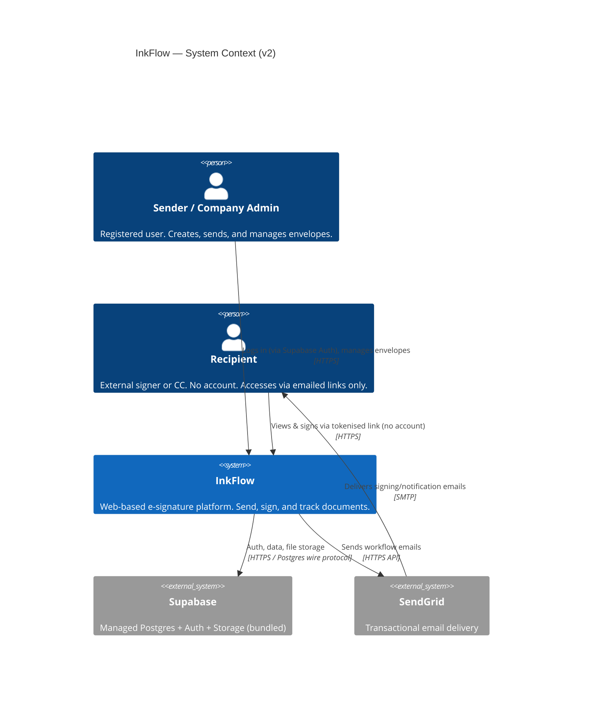
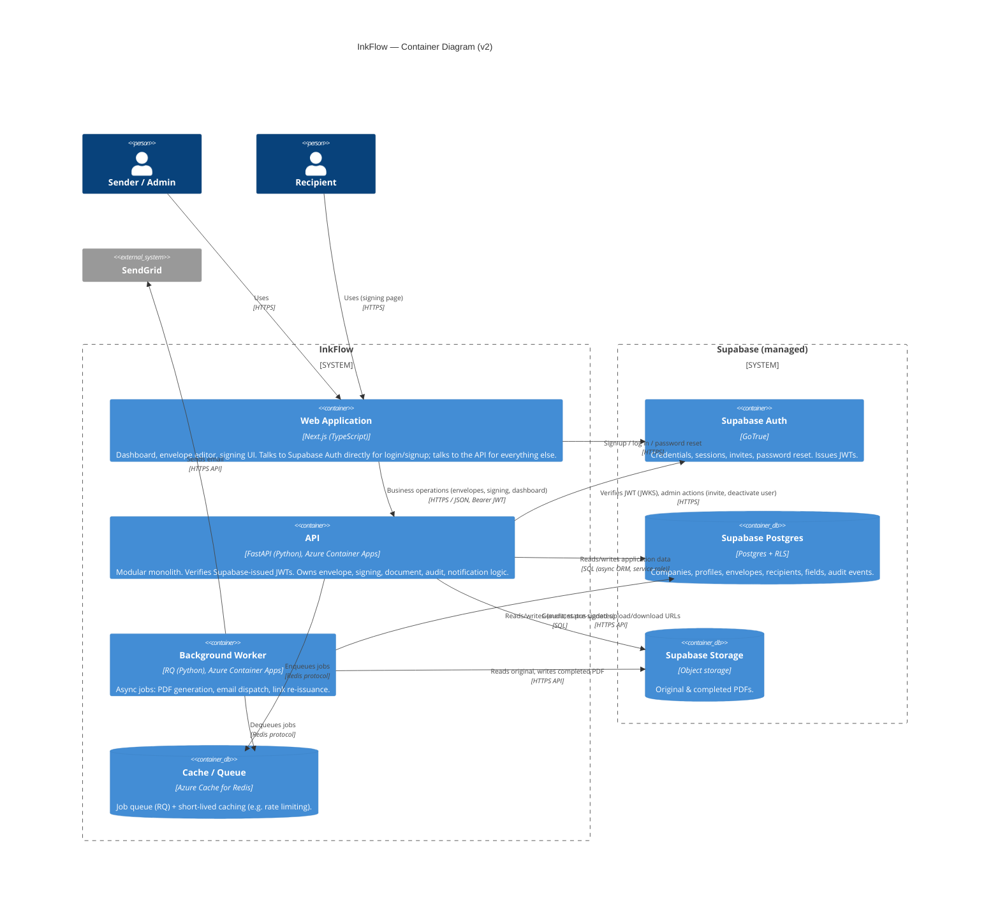
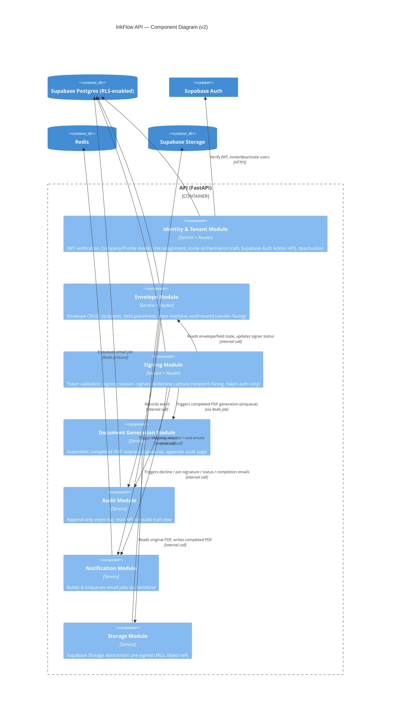

# InkFlow — Deliverable 2 (Batch 1): System Architecture Diagrams — v2

**Author:** Technical Architect
**Version:** 2.0 — supersedes v1.0
**Date:** 2026-06-30
**Status:** Draft — Awaiting Review
**Input documents:** Product Vision v1.2, updated Learning Philosophy

**Changelog v1.0 → v2.0:**
- AWS → **Azure** (compute, cache)
- Custom Identity module → **Supabase Auth** (bundled with Supabase Postgres + Supabase Storage)
- Kafka / Camunda evaluated and **excluded** from core build — noted as a Phase 2 learning-spike candidate only
- Multi-tenancy isolation strategy updated to use **Postgres Row-Level Security (RLS)** as a first-class mechanism, enabled by moving to Supabase

---

## Why the Learning Philosophy update changes this diagram materially

The old philosophy treated auth as something to build ourselves for the learning value. The new one is explicit that auth is a solved problem — buy it, don't build it — and only the signing flow, audit trail, and PDF processing stay hand-built. That's not a small tweak: it removes an entire module's worth of custom code (login, session management, password reset, invite tokens) and replaces it with configuration. This batch reflects that.

---

## 1. System Context Diagram (C4 Level 1)

**What changed and why:** AWS S3 and SES are gone as separate boxes — Supabase absorbs storage, and SendGrid remains for email (unchanged from v1, and already the product doc's own R-03 mitigation, so no new vendor introduced there). One fewer moving part at the context level.

---

## 2. Container Diagram (C4 Level 2)

**Notable shift — Web App talks to Supabase Auth directly.** This is the standard Supabase pattern (not a layering violation): the frontend handles login/signup/password-reset directly against Supabase Auth and receives a JWT, which it then attaches to every call to our own API. The API's job is to **verify** that JWT (via Supabase's JWKS endpoint) and use the `user_id` claim to look up the caller's company/role in our own tables — it does not re-implement session handling. This keeps the "buy vs. build" line clean: auth mechanics are bought, business authorization (who can see/void/sign what) stays ours.

**PDF upload path (worth knowing):** rather than routing large PDF uploads through the API, the API issues a short-lived pre-signed upload URL from Supabase Storage; the browser uploads the file directly to storage, and the API just records the resulting file reference. Same pattern for downloads. This avoids the API becoming a bottleneck for file transfer and is the standard approach with any object-storage-backed system.

---

## 3. Component Diagram (C4 Level 3) — Inside the API

**Module responsibility summary (updated):**

| Module | Owns | What changed from v1 |
|---|---|---|
| Identity & Tenant | JWT verification, Company/Profile, role assignment, invite/deactivate orchestration | Formerly "Identity" — no longer owns password/session mechanics, those are Supabase Auth's job now |
| Envelope | Envelope, Recipient, Field, state machine, void/resend | Unchanged |
| Signing | Token validation, signing session, signature/decline capture | Unchanged |
| Document Generation | Completed PDF assembly | Unchanged |
| Audit | Append-only event log | Unchanged |
| Notification | Email job construction & enqueueing (SendGrid) | Unchanged mechanism, vendor unchanged |
| Storage | Object storage abstraction | Wraps Supabase Storage instead of S3/Azure Blob |

---

## Architecture Decision Records (this batch)

### ADR-001: Modular Monolith over Microservices — *(unchanged from v1, still holds)*

### ADR-002: RQ for Background Jobs *(unchanged — now backed by Azure Cache for Redis instead of AWS-hosted Redis)*

### ADR-003: Envelope and Signing as Separate Modules *(unchanged from v1, still holds)*

### ADR-004: Adopt Supabase (bundled Auth + Postgres + Storage) — **new**
**Decision:** Use Supabase as the managed provider for authentication, the primary database, and object storage, rather than assembling these from separate vendors (e.g., Azure Postgres + Auth0 + Azure Blob).
**Why:** Per the updated Learning Philosophy, auth and object storage are solved problems not worth custom-building. Bundling them under one vendor is the simpler of the two viable paths (the alternative — Auth0/Clerk + a separately-hosted Postgres — means maintaining a mapping between two independent user-identity systems for no real benefit at this scale). One vendor, one JWT scheme, RLS policies that reference `auth.uid()` natively.
**Alternative considered:** Auth0/Clerk (auth) + Azure Database for PostgreSQL (data) + Azure Blob (storage) — rejected as more integration surface for the same outcome.
**Trade-off to note:** Supabase's free tier pauses projects after 7 days of inactivity and has no automatic backups — fine for active development, but before any demo or "production" milestone, this needs a paid tier or a scheduled keep-alive. Flagging now so it doesn't surprise anyone later (will also land in Deliverable 11, CI/CD Design).

### ADR-005: Azure for Compute (API + Worker + Redis) — **new**
**Decision:** Host the FastAPI API and RQ worker on Azure Container Apps, with Azure Cache for Redis as the queue backend.
**Why:** Matches your existing familiarity with Azure, reducing infrastructure friction so more attention goes to application-level architecture — the actual point of this project. Azure Container Apps is a reasonable, common choice for containerized services at this scale (comparable to AWS Fargate/ECS) without needing full Kubernetes.
**Alternative considered:** AWS (original default) — no longer preferred, purely a familiarity/preference call, not a technical one.

### ADR-006: Row-Level Security (RLS) as a Defense-in-Depth Layer for Multi-Tenancy — **new**
**Decision:** Enable Postgres RLS policies on tenant-scoped tables (envelopes, recipients, audit events, etc.), scoped by `company_id` derived from the authenticated user's profile — in addition to, not instead of, application-layer authorization checks in the Envelope module.
**Why:** R-07 (multi-tenancy data isolation) is flagged as a Critical-impact risk in the product doc. RLS gives us isolation enforced at the database layer itself, so even a bug in application-layer authorization logic can't leak one company's data to another. The API's primary DB connection uses a service role for orchestration convenience, but RLS remains the safety net, and it's the mechanism the web app relies on directly wherever it reads from Supabase without going through the API (e.g., the internal-recipient dashboard visibility feature, BR-12e).
**Alternative considered:** Application-layer checks only — rejected as a single point of failure for a Critical-impact risk; schema-per-tenant — rejected as unnecessary operational complexity at this scale.

### ADR-007: Kafka and Camunda Excluded from Core Architecture — **new**
**Decision:** Not used in InkFlow's Phase 1 build.
**Why:** Evaluated per your request — both are disproportionate to InkFlow's actual event volume and orchestration complexity at ~1,000 users, and would pull the design away from the modular monolith principle toward an event-streaming/workflow-engine architecture that isn't justified here. Full reasoning already discussed in chat.
**Where this learning still happens:** proposed as a standalone Phase 2 "learning spike" — e.g., re-implementing the sequential-signing orchestration as a Camunda BPMN process, or converting the Notification module's internal calls to Kafka pub/sub — done as a contained exercise after the MVP ships, not blocking it.

---

## Open Items Carried Forward to Later Batches

- **Signing/download token design** (format, storage, validation against Supabase Postgres) — Batch 4.
- **RLS policy specifics** (exact policies per table) — Batch 3 (Database Flow / ER diagram).
- **JWT verification detail** (JWKS caching, claim structure) — Batch 2 (Authentication Flow).

---

*Next: Batch 2 — Authentication Flow, Request Lifecycle. Will proceed once this batch is reviewed.*
