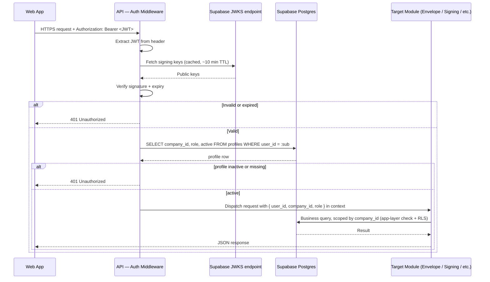
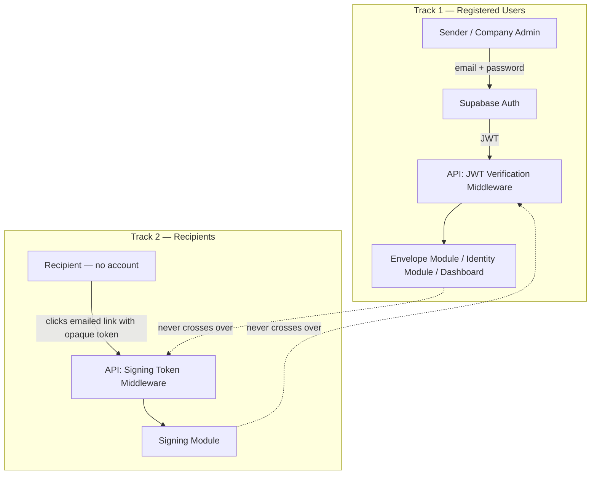

# InkFlow — Deliverable 2 (Batch 2): Authentication Flow & Request Lifecycle

**Author:** Technical Architect
**Version:** 1.0
**Date:** 2026-06-30
**Status:** Draft — Awaiting Review
**Builds on:** Batch 1 (System Architecture, v2 — Azure compute, Supabase Auth/DB/Storage)

---

## Purpose of This Batch

Batch 1 established *that* Supabase Auth handles credentials and sessions. This batch shows *how a request actually moves* through the system — from someone typing a password, to a JWT being minted, to that JWT being verified on every subsequent API call, to how that's different for recipients who never touch Supabase Auth at all.

---

## 1. Registration & Login Flow

**What this shows:** A new Company Admin signing up, and the split responsibility between Supabase (credentials) and our own API (business data — the Company itself).

```mermaid
sequenceDiagram
    participant Admin
    participant WebApp as Web App (Next.js)
    participant SBAuth as Supabase Auth
    participant API as InkFlow API
    participant DB as Supabase Postgres

    Admin->>WebApp: Enters name, email, password, company name
    WebApp->>SBAuth: signUp(email, password)
    SBAuth->>SBAuth: Create auth.users record
    SBAuth-->>WebApp: Session (JWT + refresh token), user_id
    WebApp->>API: POST /companies  (Bearer JWT)  { company_name }
    API->>API: Verify JWT (JWKS)
    API->>DB: INSERT company; INSERT profile(user_id, company_id, role=Admin)
    DB-->>API: OK
    API-->>WebApp: 201 Created — company + profile
    WebApp-->>Admin: Redirect to Dashboard
```

**Why the split:** Supabase Auth only ever knows "this email/password pair maps to this user_id." It has no idea what a "Company" is — that's InkFlow's domain model, so creating the Company record is our API's job, triggered immediately after Supabase confirms the identity exists. This is the concrete version of the "buy vs. build" line from Batch 1: identity is bought, business meaning is ours.

**Login (subsequent visits)** is simpler — no Company creation step, just:
`WebApp → SBAuth: signInWithPassword() → JWT → WebApp → API: GET /me (Bearer JWT) → API resolves company/role → Dashboard`

---

## 2. Invite & Deactivation Flow

**What this shows:** How a Company Admin adding or removing a teammate now works — this is the clearest example of the Learning Philosophy shift, since InkFlow used to own invite-token generation and now doesn't.

```mermaid
sequenceDiagram
    participant Admin
    participant WebApp as Web App
    participant API as InkFlow API
    participant SBAuth as Supabase Auth (Admin API)
    participant DB as Supabase Postgres
    participant NewUser as Invited Teammate

    Admin->>WebApp: "Invite teammate" (email)
    WebApp->>API: POST /users/invite  (Bearer JWT)  { email }
    API->>API: Verify JWT; confirm caller is Company Admin
    API->>SBAuth: Admin API — inviteUserByEmail(email)  [service role, backend-only]
    SBAuth->>SBAuth: Create auth.users (unconfirmed), generate invite link
    SBAuth-->>NewUser: Invite email (via SendGrid SMTP relay)
    SBAuth-->>API: user_id
    API->>DB: INSERT profile(user_id, company_id, role=Sender, status=pending)
    NewUser->>WebApp: Clicks invite link, sets password
    WebApp->>SBAuth: Confirm invite / set password
    SBAuth-->>WebApp: JWT (logged in)
    WebApp->>API: GET /me
    API->>DB: UPDATE profile SET status=active
    API-->>WebApp: Profile (active Sender)
```

**Deactivation** (Admin-triggered):
`Admin → API: POST /users/{id}/deactivate → API confirms caller is Admin AND this isn't the company's last active Admin (BR-05) → API calls Supabase Admin API to ban sign-in → API sets profile.active = false`

**Detail worth flagging:** Supabase Auth's own system emails (invite links, password resets) are routed through a custom SMTP relay configured to use **SendGrid** — the same provider as our workflow emails. This keeps deliverability consistent (same sender reputation, same SPF/DKIM setup) rather than relying on Supabase's shared default mail sender, which has weaker deliverability guarantees. One vendor for all outbound email, even though two different systems (Supabase Auth, our Notification module) are triggering it.

**Security note on deactivation timing:** disabling sign-in at Supabase stops *new* logins immediately, but a user's *existing* JWT is cryptographically valid until it expires (Supabase's default access-token lifetime is short — on the order of an hour). This is exactly why ADR-008 (below) matters: because we look up `profiles.active` from our own DB on every request rather than trusting a claim baked into the JWT, a deactivated user is locked out of the API on their very next request, regardless of whether their token has technically expired yet.

---

## 3. JWT Verification & Request Lifecycle

**What this shows:** The path every single authenticated API request takes, end to end. This is the diagram Backend Engineers will reference most.



**Why JWKS keys are cached, not fetched per-request:** hitting Supabase's JWKS endpoint on every single API call would add a network round-trip to every request and create an unnecessary dependency — if that endpoint hiccups, the entire API goes down with it. Caching the public keys locally (short TTL, e.g. 10 minutes) is the standard pattern for any JWT-based system; keys rotate rarely, so a short cache window is a non-issue in practice.

**Why the DB profile lookup happens on every request:** this is ADR-008, below.

---

## 4. The Two-Track Auth Model

**What this shows, explicitly:** InkFlow doesn't have one auth system — it has two, running in parallel, that never intersect. This has been implicit since the product doc's Recipient definition, but it's worth diagramming directly since it drives the Signing module's isolated design (ADR-003, Batch 1).



**Why this separation is deliberate, not incidental:** Recipients must never be able to authenticate as if they were registered users, and registered users signing a document (BR-12d, self-signing) still go through the *Signing* token path for that specific action, not their session — signing is always token-gated, even for someone who happens to be logged in elsewhere. Keeping these as two fully separate middleware stacks (Supabase JWT vs. opaque signing token) means a bug in one can't accidentally grant access via the other. Token design itself (format, storage, validation) is covered in Batch 4.

---

## Architecture Decision Records (this batch)

### ADR-008: Authorization Data via Per-Request DB Lookup, Not Custom JWT Claims
**Decision:** On every authenticated request, the API looks up `company_id`/`role`/`active` from our own `profiles` table using the JWT's `user_id`, rather than baking those into the JWT itself via Supabase's Custom Access Token Hook.
**Why:** The alternative (custom claims) avoids a DB hit per request but means that data is only as fresh as the last token refresh — a deactivated user's existing JWT would still cryptographically "prove" they're active until it expires. That's a direct conflict with BR-04 ("a deactivated user cannot log in") needing to take effect promptly. A plain indexed lookup is simple, always correct, and at ~1,000 users the added latency is negligible — "simple and correct" beats "fast but stale" here, especially given the product doc treats security as non-negotiable.
**Alternative considered:** Custom Access Token Hook (Supabase feature for embedding claims in the JWT) — rejected due to staleness risk on deactivation; would need a token-revocation mechanism on top to close that gap, which is more complexity than the lookup it was meant to avoid.

---

## Open Items Carried Forward

- **Signing token format/validation** (the opaque token in Track 2 above) — Batch 4.
- **RLS policy specifics** referenced in the request lifecycle diagram — Batch 3.

---

*Next: Batch 3 — Database Flow (ER diagram), Storage Flow. Will proceed once this batch is reviewed.*
