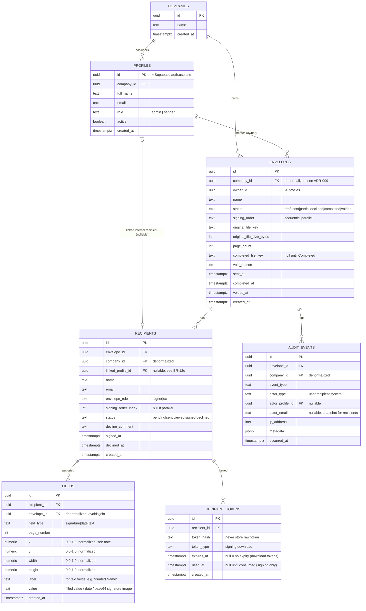
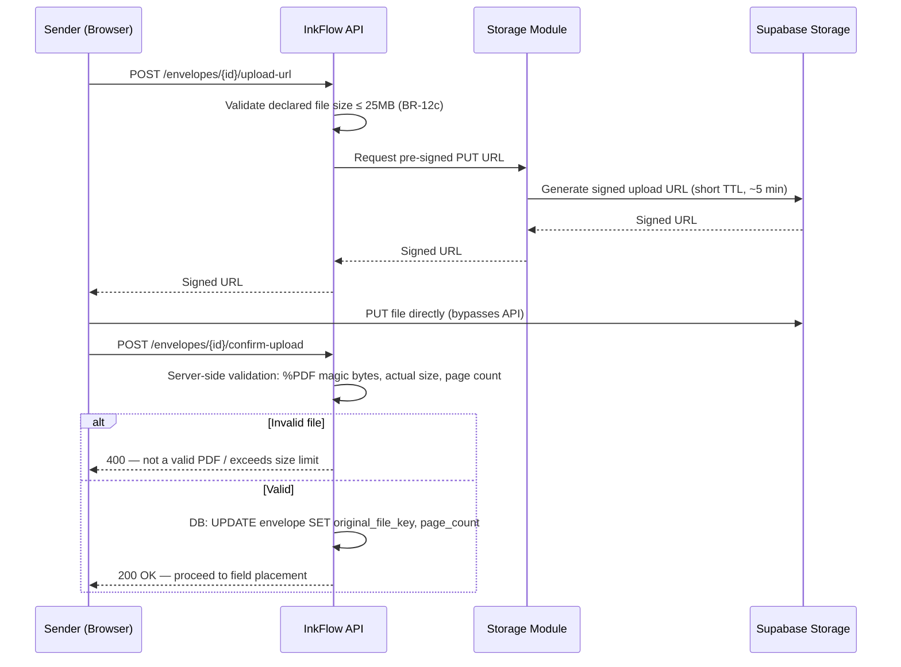
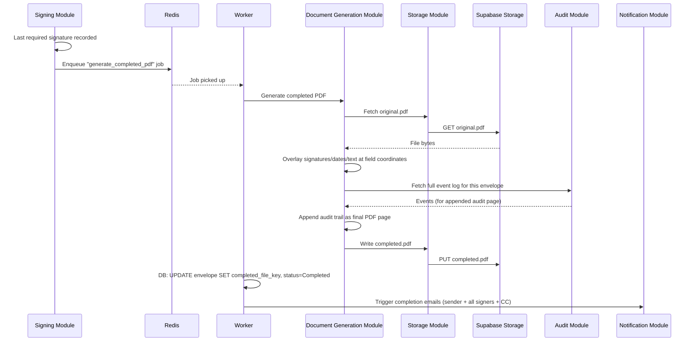
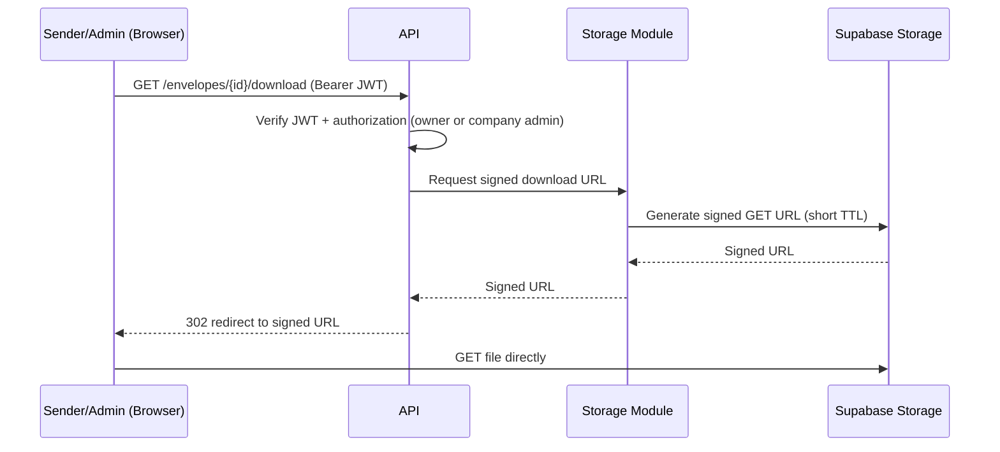
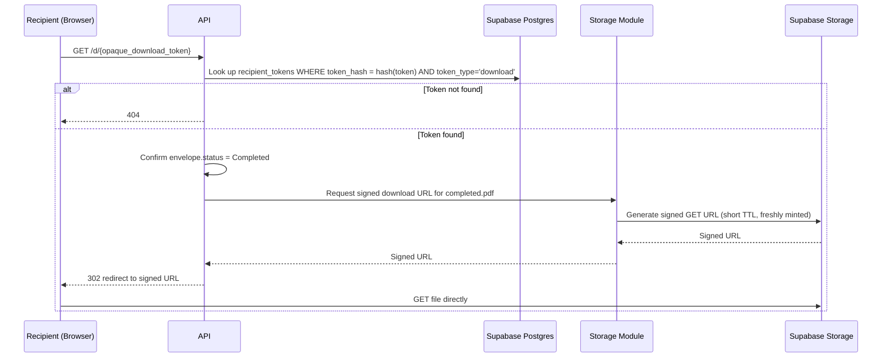

# InkFlow — Deliverable 2 (Batch 3): Database Flow & Storage Flow

**Author:** Technical Architect
**Version:** 1.0
**Date:** 2026-06-30
**Status:** Draft — Awaiting Review
**Builds on:** Batch 1 (System Architecture), Batch 2 (Auth Flow)

---

## Purpose of This Batch

Batch 1 said RLS policy specifics and storage layout were coming here. This batch defines the actual data model (every table, every relationship) and how PDFs move in and out of Supabase Storage — including the one piece that needs real thought: how an external recipient gets a completed PDF "indefinitely" (BR-24) when the underlying storage URLs themselves can't be indefinite.

---

## 1. Entity-Relationship Diagram

**What this shows:** Every table in Supabase Postgres and how they relate. This is the schema the Database Engineer will build migrations from.



**A few deliberate choices worth explaining:**

- **`company_id` is denormalized** onto `envelopes`, `recipients`, `fields` (via envelope), and `audit_events` — not strictly necessary from a normalization standpoint (you could always join up to `envelopes.company_id`), but it makes every RLS policy a single-column check instead of a subquery through 1-3 joins. At write time this costs nothing (it's set once, alongside the FK); at read time — which happens far more often — it keeps every tenant-isolation check cheap. This is a common, deliberate trade-off in RLS-heavy schemas. See ADR-009.
- **`fields.value` is a single polymorphic text column** rather than three separate typed columns (signature_value, date_value, text_value). Simpler schema, and the field's meaning is already unambiguous from `field_type`. A signature's "value" is a base64-encoded PNG (small — a signature image is a few KB, so it lives directly in Postgres rather than warranting a separate Storage object; see ADR-010).
- **`fields.x/y/width/height` are normalized fractions (0.0–1.0) of the page**, not absolute pixel coordinates. A signature placed at `x=0.5` renders at the horizontal midpoint of the page regardless of what zoom level or screen size the Sender used to place it, or what render size the Document Generation module uses when producing the final PDF. Storing raw pixel coordinates tied to one specific viewer size would make field placement fragile and is a common real source of the "signatures render in the wrong place" bug class R-02/R-05 in the product doc already worry about.
- **`recipient_tokens` is its own table, one-to-many off `recipients`**, not columns on `recipients` directly — because a single recipient can accumulate multiple tokens over their lifecycle: one signing token (7-day expiry, single-use-until-consumed per BR-16), and potentially several download tokens over time if "resend my copy" (F-33a) is used more than once. `token_hash` stores a hash, never the raw token — same principle as password storage, so a DB leak doesn't leak usable tokens. Full token format is Batch 4's job; this table is just the storage shape.
- **`linked_profile_id` on `recipients`** is the concrete implementation of BR-12e (internal recipient dashboard visibility) — nullable, populated at recipient-creation time if the recipient's email matches an existing `profiles.email` in the same company. This is what the "read-only dashboard visibility" feature queries against.

---

## 2. Row-Level Security (RLS) — Policy Summary

**Correction, see ADR-027:** base `GRANT SELECT` statements to the `authenticated` role were never specified for any table below. A policy without a grant is inert — Postgres checks table-level privileges before it evaluates RLS policies at all, so as originally specified here, none of these policies were reachable by the `authenticated` role. The policies themselves (as written below) were correct; ADR-027 completes the mechanism with the missing grants. (A companion correction to this section's `companies` policy and `current_user_company_id()`'s `SECURITY DEFINER` status was also proposed during the same review and withdrawn — both were already correct as implemented; see `docs/adr/README.md`.)

**What this shows:** How tenant isolation (R-07, Critical risk) is enforced at the database layer, as promised in Batch 1 (ADR-006).

| Table | Policy (conceptual) |
|---|---|
| `profiles` | `company_id = (SELECT company_id FROM profiles WHERE id = auth.uid())` |
| `envelopes` | `company_id = current_user_company_id()` — a small SQL helper function wrapping the same subquery, reused everywhere |
| `recipients` | `company_id = current_user_company_id()` **OR** `linked_profile_id = auth.uid()` (covers BR-12e — an internal recipient can read their own linked row even outside their own company's envelope-owner path) |
| `fields`, `audit_events` | `company_id = current_user_company_id()` |
| `recipient_tokens` | **No RLS policy granting row access to any authenticated user** — this table is only ever touched by the API's service-role connection (which bypasses RLS by design), never queried directly from the browser. Tokens are validated server-side only. |

**Why a SQL helper function (`current_user_company_id()`) instead of repeating the subquery in every policy:** keeps every policy definition short and consistent, and if the lookup logic ever needs to change (e.g., caching, a different resolution path), it changes in one place. Standard practice in any RLS-heavy Postgres schema.

**Important nuance already flagged in Batch 1, restated here concretely:** the API's primary connection to Supabase Postgres uses the **service role**, which bypasses RLS entirely — RLS is not what protects data from a compromised API; application-layer `company_id` checks in the Envelope/Signing modules do that primary job. RLS is the safety net for two specific cases: (1) a bug in application-layer logic, and (2) any place the **web app reads Supabase directly**, bypassing the API — which today is only the internal-recipient dashboard visibility read (BR-12e), a deliberate, narrow exception.

---

## 3. Storage Layout (Supabase Storage)

**Bucket structure:**

```
bucket: envelope-documents
├── {company_id}/
│   └── {envelope_id}/
│       ├── original.pdf
│       └── completed.pdf   (written only once envelope reaches Completed)
```

Path-prefixing by `company_id` isn't a security boundary on its own (Storage access is still governed by signed URLs / policies, not by "guessing the path"), but it keeps the bucket organized and makes company-level operations (e.g., a future "export all our documents" feature) straightforward.

---

## 4. Storage Flow — Upload (Sender creates envelope)



**Why server-side validation on confirm, not just trusting the browser:** the browser can declare any file extension or MIME type it wants before upload — BR-12c ("PDF only, 25MB max") is a business rule, not just a UI hint, so the API independently checks the actual uploaded bytes (PDF magic number, real size, real page count) before the envelope is allowed to proceed past Draft. This is a small but real security/correctness step that's easy to skip and shouldn't be.

---

## 5. Storage Flow — Completed PDF Generation (Worker)



This is the async path Batch 1's Container Diagram set up specifically to keep the API request/response cycle fast — the actual signing request that triggers this only waits for the DB write and the enqueue, not for PDF assembly itself.

---

## 6. Storage Flow — Download (Registered Users, BR-23a)

Straightforward, since registered users only ever access documents through the platform:



---

## 7. Storage Flow — Download (External Recipients, BR-23b) — the interesting case

**The tension to solve:** BR-23b says an external recipient can access their completed document "at any time" (documents retained indefinitely, BR-24) — but Supabase Storage's signed URLs, like any object-storage signed URL, have a bounded maximum lifetime. You cannot generate a signed URL that's valid forever. So the emailed link **cannot literally be** a raw signed storage URL — it needs a layer of indirection.

**The solution:** the emailed link points to *our own API*, using our own long-lived (or non-expiring) `recipient_tokens` row — not directly at Supabase Storage. Every time the link is clicked, the API mints a **fresh, short-lived** signed URL on the spot and redirects to it. The link in the recipient's inbox stays constant and permanent from their point of view; the actual signed URL behind it is regenerated fresh every single time.



**"Resend my copy" (F-33a):** reachable as a button on the download landing page itself (the recipient is already validated by virtue of being there via a working token) — it simply re-triggers the completion email to the same address, and logs `envelope.download_link_reissued`. It does **not** require minting a brand-new token by default, since the existing download token doesn't expire; it's there mainly for "I can't find the original email" convenience. If a token is ever found to be compromised, an Admin/Sender-triggered token revocation is a reasonable Phase 2 addition — not needed for Phase 1 since nothing in the product doc calls for it.

---

## Architecture Decision Records (this batch)

### ADR-009: Denormalize `company_id` Onto Child Tables for RLS
**Decision:** Store `company_id` directly on `envelopes`, `recipients`, `fields`, and `audit_events`, rather than requiring every RLS policy to join up through `envelope_id`.
**Why:** Keeps every RLS policy a flat, cheap, single-column comparison instead of a subquery/join on every row-access check — RLS policies run on every single query touching these tables, so keeping them cheap matters more than avoiding a small amount of denormalization. This is a widely used pattern specifically for multi-tenant RLS schemas.
**Alternative considered:** Fully normalized schema with joins in RLS policies — rejected as unnecessary query overhead for a well-understood trade-off.

### ADR-010: Signature Images Stored Inline (Postgres), Not in Object Storage
**Decision:** A captured signature (typed or drawn) is stored as a base64-encoded PNG directly in `fields.value`, not as a separate object in Supabase Storage.
**Why:** Signature images are tiny (a few KB). Round-tripping to Storage for something this small adds a network call and a second system to keep in sync with the DB row, for no real benefit. Postgres handles small binary-as-text payloads at this size without issue.
**Alternative considered:** Store as a Storage object, reference by key — rejected as unnecessary indirection at this size.

### ADR-011: Indirection Layer for External Download Links
**Decision:** Emailed download links point at InkFlow's own API (`/d/{token}`), which mints a fresh short-lived signed Storage URL on every click, rather than embedding a signed Storage URL directly in the email.
**Why:** Object storage signed URLs have a bounded max lifetime by design (a security feature, not a limitation to work around) — but BR-23b requires indefinite access. The only way to reconcile "indefinite" with "storage URLs must expire" is a layer of indirection: our own token is the thing that's long-lived, and it always resolves to a freshly-minted, short-lived URL underneath. This is the standard pattern for "permanent" download links backed by any cloud object store.
**Alternative considered:** Longest-allowed signed URL embedded directly in the email — rejected; still eventually expires (contradicts BR-24/BR-23b), and can't be revoked once sent.

### ADR-012: Normalized (Fractional) Field Coordinates
**Decision:** `fields.x/y/width/height` are stored as 0.0–1.0 fractions of the page dimensions, not absolute pixel positions.
**Why:** Directly mitigates R-02/R-05 (PDF rendering / signature placement accuracy risk) — a signature placed at a fractional position renders correctly regardless of the zoom level or screen size used when the Sender placed it, or the resolution the Document Generation module renders the final PDF at.
**Alternative considered:** Absolute pixel coordinates tied to one reference render size — rejected as fragile across different viewers/zoom levels.

---

## Open Items Carried Forward

- **Signing token exact format** (structure, hashing algorithm, generation) — Batch 4.
- **PDF field-overlay implementation detail** (which library, how signature images get composited onto the page) — Batch 4 (PDF Processing Flow).

---

*Next: Batch 4 — PDF Processing Flow, Signing Workflow (technical-level). Will proceed once this batch is reviewed.*
