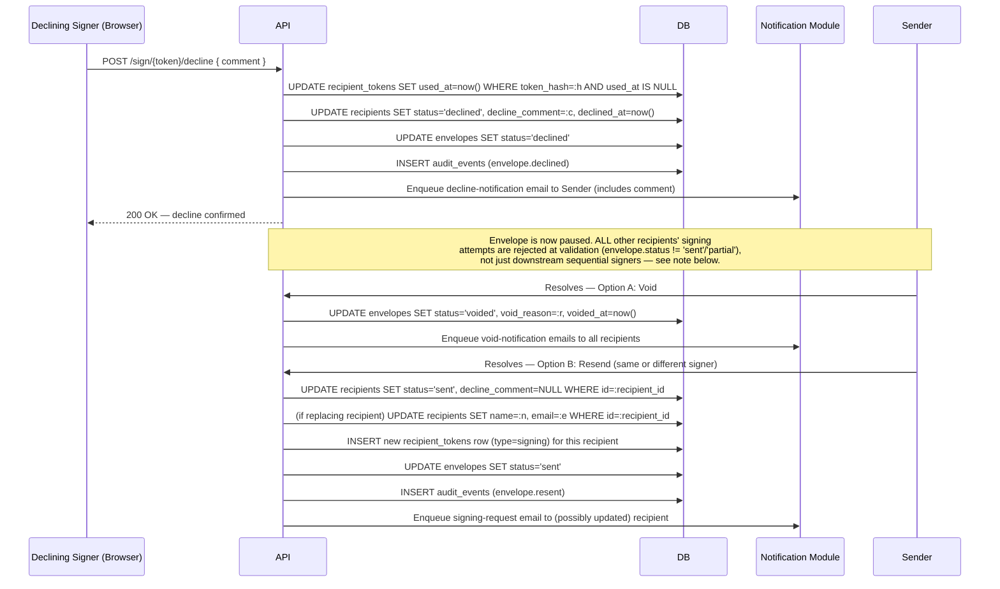
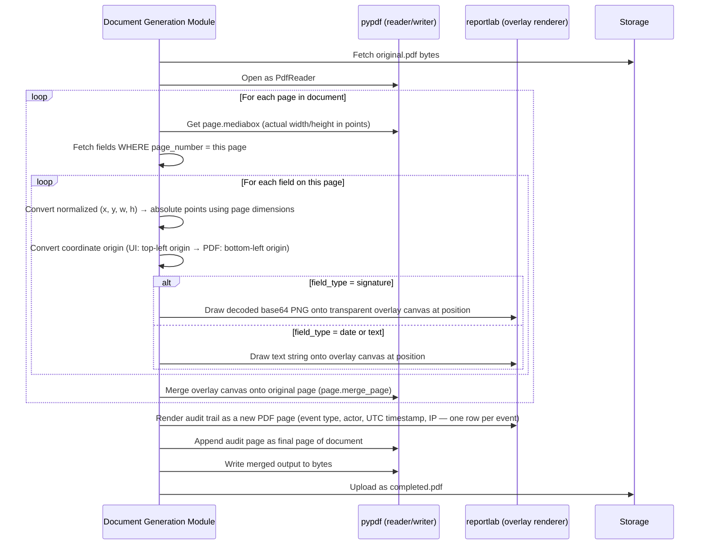

# InkFlow — Deliverable 2 (Batch 4): PDF Processing Flow & Signing Workflow (Technical Level)

**Author:** Technical Architect
**Version:** 1.0
**Date:** 2026-06-30
**Status:** Draft — Awaiting Review
**Builds on:** Batch 1 (System Architecture), Batch 2 (Auth Flow), Batch 3 (Database/Storage Flow)

---

## Purpose of This Batch

The product doc's Signing Workflow (Section 9) describes *what* happens from a business perspective. This batch describes *how* — the exact token mechanics, the concurrency-safe orchestration behind sequential signing, precisely what "paused" means technically during a decline, and how a completed PDF actually gets assembled byte-by-byte. This is the batch Backend Engineers will implement directly against.

---

## 1. Signing / Download Token Design

**What this shows:** The exact shape of the opaque token referenced since Batch 2 (Track 2 auth) and stored in Batch 3's `recipient_tokens` table.

**Generation:**
- A token is a cryptographically random 256-bit value (`secrets.token_urlsafe(32)` in Python), URL-safe, ~43 characters.
- The **raw token** is sent to the recipient (embedded in the email link: `https://app.inkflow.com/sign/{raw_token}` or `/d/{raw_token}`) and is **never stored**.
- Only `SHA-256(raw_token)` is persisted, in `recipient_tokens.token_hash` — identical principle to password storage. A database leak doesn't leak usable tokens.

**Validation (every request that includes a token):**
```
1. Compute SHA-256(raw_token_from_url)
2. SELECT * FROM recipient_tokens WHERE token_hash = :hash AND token_type = :expected_type
3. If no row → 404
4. If token_type = 'signing':
     - expires_at must be in the future (BR-16, 7 days from envelope send)
     - used_at must be NULL (not yet consumed)
5. Check envelope.status is in a state where this action is valid:
     - Signing:  envelope.status IN ('sent', 'partial')
     - Download: envelope.status = 'completed'
6. If any check fails → 410 Gone (expired/invalid) — deliberately not a generic 404,
   so the frontend can show "this link is no longer active" rather than "not found"
```

**Why envelope status is checked at validation time, not baked into the token:** this is the mechanism that makes void/decline/completion instantly invalidate every outstanding signing link, without having to touch every `recipient_tokens` row individually. A token can be structurally valid (unexpired, unused) and still be rejected because the envelope moved to `voided` or `declined` in the meantime. One state check covers every recipient at once.

**Signing token vs. download token — mechanical differences:**

| | Signing token | Download token |
|---|---|---|
| Minted | When envelope is sent (sequential: per-signer, staggered — see §2) | When envelope reaches `completed` |
| Expiry | 7 days (BR-16) | None (BR-23b) |
| Reusable? | Viewable many times (`envelope.viewed` logged each open), but **consumed** on signature/decline submission — `used_at` set, permanently invalid after | Reusable indefinitely — `used_at` stays NULL always, no single-use semantics |
| Consumption is atomic | `UPDATE recipient_tokens SET used_at = now() WHERE id = :id AND used_at IS NULL RETURNING *` — the `WHERE used_at IS NULL` guard is what prevents a double-submit race (two concurrent requests both trying to sign) from both succeeding | N/A — no consumption concept |

**Security note:** the signing/download endpoints are unauthenticated by nature (that's the point), so they're rate-limited per-IP and per-token-hash-prefix at the API layer to blunt brute-force token guessing, even though 256-bit tokens make guessing computationally infeasible on their own. Defense in depth, cheap to add.

---

## 2. Sequential Signing Orchestration

**What this shows:** The concurrency-safe mechanism guaranteeing signer N+1 is never notified before signer N completes (BR-13).

```mermaid
sequenceDiagram
    participant SignerN as Signer N (Browser)
    participant API
    participant DB as Supabase Postgres
    participant Notif as Notification Module

    SignerN->>API: POST /sign/{token}  { signature, filled fields }
    API->>DB: BEGIN transaction
    API->>DB: UPDATE recipient_tokens SET used_at=now() WHERE token_hash=:h AND used_at IS NULL
    alt No row updated (already consumed — race lost)
        API->>DB: ROLLBACK
        API-->>SignerN: 409 Conflict — already signed
    else Token consumed successfully
        API->>DB: UPDATE recipients SET status='signed', signed_at=now() WHERE id=:recipient_id
        API->>DB: INSERT audit_events (envelope.signed)
        API->>DB: SELECT next recipient WHERE envelope_id=:id AND envelope_role='signer'
                   AND signing_order_index > :current_index
                   ORDER BY signing_order_index ASC LIMIT 1
        alt Next signer exists
            API->>DB: Generate new recipient_tokens row (type=signing) for next signer
            API->>DB: UPDATE recipients SET status='sent' WHERE id=:next_id
            API->>DB: COMMIT
            API->>Notif: Enqueue "signing request" email for next signer
        else No next signer (this was the last one)
            API->>DB: UPDATE envelopes SET status='completed', completed_at=now()
            API->>DB: COMMIT
            API->>Notif: Enqueue completed-PDF generation job (see §4) + completion emails
        end
        API-->>SignerN: 200 OK — confirmation screen
    end
```

**Why this is safe under concurrency without extra locking:** the `WHERE used_at IS NULL` guard on the token-consumption UPDATE is an atomic compare-and-set at the database level — Postgres guarantees only one concurrent transaction can win that update for a given row. Everything downstream (finding the next signer, notifying them) only happens inside the branch where *this* request won that race, so it's structurally impossible for two "next signer" notifications to fire from the same signature event.

**Parallel envelopes:** simpler — at Send time, `recipient_tokens` rows (type=signing) are minted for *every* signer at once, and every notification goes out immediately. No "next signer" lookup — each signer's completion just checks "are all required signers now `signed`?" to decide whether to trigger completion.

---

## 3. Decline Handling — Technical Flow

**What this shows:** The concrete mechanics of BR-15a — what locks, what unlocks, and how the sender's two resolution paths work as state transitions.



**Note on the "all recipients, not just downstream" pause:** the product doc's state diagram (Section 9) shows `Sent → Declined` and `PartialSigned → Declined` as envelope-wide transitions — there's no parallel-specific carve-out. So in a **parallel** envelope, if Signer A declines while Signer B still has an open, unsubmitted signing page, Signer B's eventual submit attempt is technically rejected (envelope status check fails, per §1) rather than silently succeeding into an inconsistent state. This is a direct, consistent application of the state machine the product doc already defines — flagging it explicitly here because it's the kind of thing that's easy to implement inconsistently (e.g., only blocking sequential downstream signers) if not called out. See ADR-016.

**Assumption flagged for your visibility (not blocking):** "resend to a different signer" (Journey 3b) is implemented as editing that recipient's name/email in place, rather than removing and adding a new recipient row — simpler, and preserves the `signing_order_index` position for sequential envelopes. No business rule currently states whether recipient details can be edited post-Send; this is a narrow, single-purpose exception scoped only to the decline-resolution action. Flag to the PM if you'd like it formalized as a business rule; otherwise I'll treat this as settled.

---

## 4. PDF Processing Flow — Document Generation Detail

**What this shows:** Exactly how field placements + captured signatures become a flattened, completed PDF with the audit trail appended — the internals of the Document Generation Module first introduced in Batch 1.



**Coordinate conversion, spelled out (the one genuinely fiddly part):** Batch 3 stores field position as normalized fractions (0.0–1.0) with a **top-left origin**, matching how field placement works in a browser (the Sender drags a box on a rendered page image, and `(0,0)` is naturally the top-left corner of what they see). PDF's native coordinate system has a **bottom-left origin**. So placing a field correctly requires: `pdf_x = x_fraction * page_width`, and `pdf_y = page_height - (y_fraction * page_height) - (height_fraction * page_height)` — flipping the Y axis and accounting for the field's own height. Getting this wrong is the single most common bug class in "why is my signature in the wrong place" reports (directly R-02/R-05 from the product doc's risk list) — worth Backend Engineers writing a dedicated test fixture for this conversion in isolation before wiring up the full pipeline.

**Why no interactive PDF form fields (AcroForm):** field placement never creates real fillable PDF form widgets — it's purely coordinates stored in our own DB, rendered as flattened image/text stamps at generation time. This sidesteps a real can of worms: uploaded PDFs may already contain their own AcroForm fields, embedded fonts, or malformed form structures, and merging/flattening third-party AcroForms reliably is a much harder, less predictable problem than "draw an image at a coordinate." The trade-off is that InkFlow can't offer form-field-aware smart placement (e.g., "detect the existing signature line") in Phase 1 — consistent with the product doc's intentionally minimal Phase 1 field types (Signature, Date, basic Text only). See ADR-015.

---

## Architecture Decision Records (this batch)

### ADR-013: Opaque, Hashed, Status-Gated Tokens for Recipient Access
**Decision:** Signing/download tokens are 256-bit random opaque values, stored only as SHA-256 hashes, with validity determined by a combination of the token row's own state (expiry/consumption) **and** a live check of `envelope.status` at request time.
**Why:** Checking envelope status live means voiding, declining, or completing an envelope instantly invalidates every outstanding token without an update-every-row operation. Combined with hashed storage (never storing the raw token), this is the standard, low-risk pattern for unauthenticated-link-based access.
**Alternative considered:** JWT-based signing tokens (self-contained, no DB lookup) — rejected because self-contained tokens can't be live-invalidated on void/decline without a revocation list, which reintroduces the exact DB-lookup cost it was meant to avoid (same reasoning as ADR-008 in Batch 2).

### ADR-014: pypdf + reportlab for PDF Processing
**Decision:** Use `pypdf` (reading, page manipulation, merging) and `reportlab` (rendering overlay content and the audit trail page) as pure-Python libraries, rather than a browser-based renderer (headless Chromium / wkhtmltopdf) or a paid PDF SDK.
**Why:** No external binary/browser dependency to manage inside the Worker container — pure Python packages install via pip and run anywhere. Precise coordinate-based overlay onto an *existing* uploaded PDF is exactly what these libraries are designed for; browser-based renderers are built for generating PDFs from HTML/CSS from scratch, which isn't this problem. Keeps the Worker container lean and the dependency surface small.
**Alternative considered:** headless Chromium (via Playwright/Puppeteer) — rejected as heavyweight for this specific task (large container image, browser process management) and a poor fit for "overlay onto existing PDF" vs. "render new PDF from markup." Paid PDF SDKs (e.g., Aspose) — rejected, no need to introduce a licensing cost for a problem these free libraries solve well.

### ADR-015: Field Overlay via Image/Text Stamping, Not Interactive AcroForm Fields
**Decision:** Signature, date, and text fields are rendered as flattened image/text stamps at document-generation time, not as real interactive PDF form fields.
**Why:** Uploaded PDFs may already contain their own (unrelated) form fields, fonts, or structural quirks — reliably injecting and later flattening AcroForm widgets into arbitrary third-party PDFs is a materially harder and less predictable problem than drawing content at a known coordinate. Given Phase 1's field types are intentionally minimal (Signature, Date, basic Text — no checkboxes, no conditional logic), stamping is sufficient and much lower-risk.
**Alternative considered:** True AcroForm field injection — rejected as unnecessary complexity and reliability risk for what Phase 1 actually needs.

### ADR-016: Decline Pauses the Entire Envelope, Not Just the Downstream Chain
**Decision:** Once any recipient declines, all other recipients' pending signing attempts are rejected (via the live envelope-status check in token validation, §1) until the sender resolves the decline — including already-notified parallel signers, not only sequential downstream signers.
**Why:** The product doc's state diagram already models decline as an envelope-wide transition (`Sent/PartialSigned → Declined`) with no parallel-specific exception. Enforcing this uniformly via the same status-check mechanism already used for void/completion avoids a special case that would otherwise be easy to implement inconsistently.
**Alternative considered:** Only blocking sequential downstream signers, letting already-notified parallel signers complete — rejected as inconsistent with the product doc's own state model and creates a confusing partial-pause state.

---

## Open Items Carried Forward

- **User Flow Diagrams** (navigation-level, frontend-facing) — Batch 5, the final piece of Deliverable 2.

---

*Next: Batch 5 — User Flow Diagrams. Will proceed once this batch is reviewed.*
