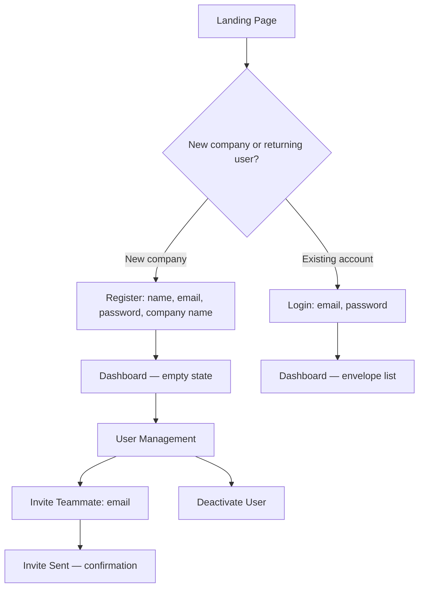
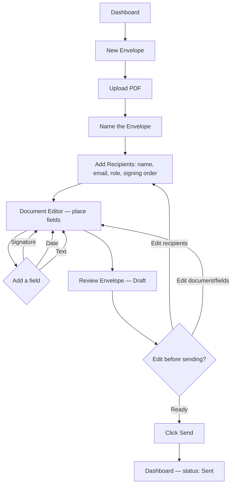
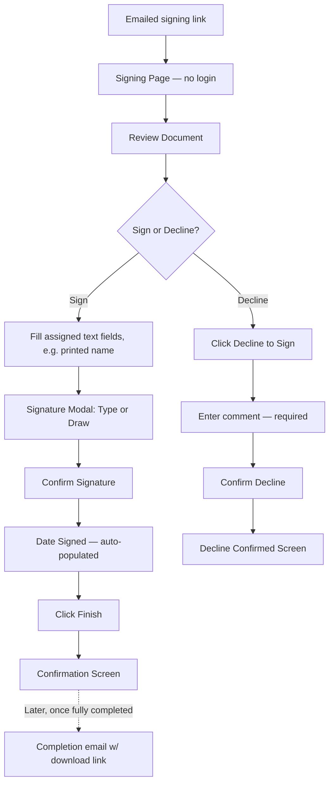
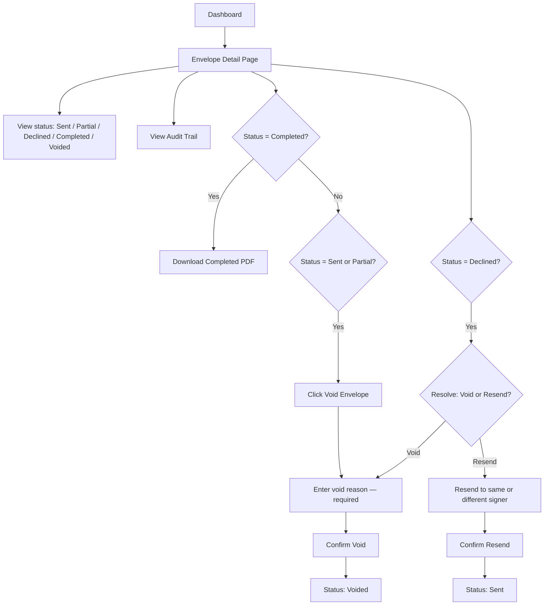
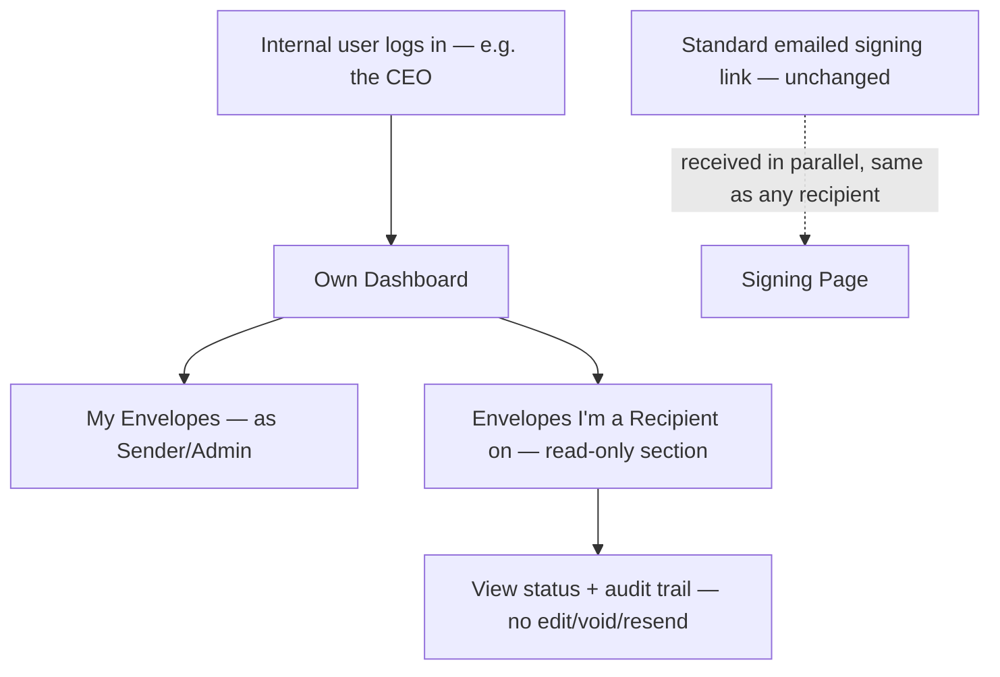

# InkFlow — Deliverable 2 (Batch 5): User Flow Diagrams

**Author:** Technical Architect
**Version:** 1.0
**Date:** 2026-06-30
**Status:** Draft — Awaiting Review
**Builds on:** Product Vision v1.3 (Journeys 1–5, 3b, 3c), Batches 1–4

---

## Purpose of This Batch

Batches 1–4 answered "what talks to what" and "how does a request move through the system." This batch answers a different question: "what does a user actually click through, screen by screen?" These are navigation-level flowcharts, not sequence diagrams — no backend calls, no tokens, no DB. They exist to give the Frontend Engineer and UI/UX Designer a shared map before either of them starts on routes or wireframes.

**Scope note:** these diagrams name screens and transitions, not layouts or visual design — wireframes are the UI/UX Designer's deliverable, not this one.

---

## Flow A — Admin Onboarding & Login (Journey 1)



---

## Flow B — Sender Creates & Sends an Envelope (Journey 2)



**Note:** the Draft state (BR-12a) means every arrow feeding back into Recipients/Editor from Review is fully valid — a Sender can loop through this cycle as many times as needed before Send. Nothing here is transient or one-shot until "Send" is clicked.

---

## Flow C — Recipient Signs or Declines (Journey 3 / 3b)



**Note:** the dotted arrow to `DownloadLink` is deliberate — it doesn't happen immediately after signing, only once *all* required signers finish (BR-21). A signer who completes early sees the Confirmation Screen and then, per BR-20c, gets periodic status-update emails until the envelope reaches Completed.

---

## Flow D — Sender Monitors, Downloads, and Resolves (Journey 4 / 5)



---

## Flow E — Internal Recipient Dashboard Visibility (Journey 3c)



**Note:** this internal recipient still gets the ordinary email link and signs exactly like an external recipient (Flow C) — the dashboard visibility is purely additive, not a replacement signing path. This matches BR-12e: the signing *experience* never changes for internal recipients, only their visibility does.

---

## Screen Inventory (for Frontend Engineer / UI-UX Designer handoff)

| Screen | Auth context | Journey(s) |
|---|---|---|
| Landing Page | Public | 1 |
| Register | Public | 1 |
| Login | Public | 1 |
| Dashboard (envelope list) | Session (Supabase JWT) | 1, 4, 3c |
| User Management | Session, Admin only | 1 |
| New Envelope / Upload | Session | 2 |
| Document Editor (field placement) | Session | 2 |
| Recipients Form | Session | 2 |
| Envelope Review (Draft) | Session | 2 |
| Envelope Detail Page | Session | 4, 5, 3c |
| Signing Page | Signing token (no session) | 3, 3b |
| Decline Confirmation | Signing token (no session) | 3b |
| Download Landing Page | Download token (no session) | 4 (external recipients, Batch 3 §7) |

---

## Route Naming Convention (draft — Frontend Engineer to finalize)

A first pass, kept consistent with the token/auth design from Batches 2 and 4, so routing and backend endpoints read the same way:

```
/register, /login                          — public
/dashboard                                  — session required
/envelopes/new                              — session required
/envelopes/{id}                             — session required (detail view)
/envelopes/{id}/edit                        — session required (Draft only)
/users                                      — session required, Admin only
/sign/{token}                               — signing token, no session
/d/{token}                                  — download token, no session
```

This isn't a formal deliverable on its own (API Conventions, Deliverable 7, will own the backend-side naming rules) — just recorded here so the frontend and backend routes stay conceptually aligned from day one.

---

## Deliverable 2 — Complete

With this batch, all five pieces of Architecture Diagrams are done:

| Batch | Contents | Status |
|---|---|---|
| 1 | System Context (C4 L1), Container (C4 L2), Component (C4 L3) | ✅ Approved |
| 2 | Authentication Flow, Request Lifecycle | ✅ Approved |
| 3 | Database Flow (ER diagram), Storage Flow | ✅ Approved |
| 4 | PDF Processing Flow, Signing Workflow (technical) | ✅ Approved |
| 5 | User Flow Diagrams | Awaiting review |

Sixteen ADRs recorded across the deliverable (ADR-001 through ADR-016), covering everything from modular monolith structure down to token design and coordinate-conversion math.

---

*Next, pending your approval: Deliverable 3 — Engineering Handbook.*
