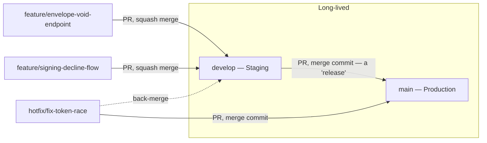

# InkFlow — Branching Strategy

**Author:** Technical Architect
**Version:** 1.0
**Date:** 2026-07-01
**Status:** Draft — Awaiting Review
**Builds on:** Deliverable 3 (Engineering Handbook §8), Deliverable 5 (Coding Standards — commit format)

---

## Purpose

The Handbook (§8) already stated the *principles* — PR-gated, small focused commits, reviewable in one sitting. This deliverable is the concrete mechanics: which branches exist, how they merge, how a release gets tagged.

---

## A note on scope before the model itself

The Sprint 0 deliverable list names GitFlow's exact branch set — `main`, `develop`, `feature/*`, `hotfix/*`, `release/*`. I'm recommending we keep four of those five and **drop `release/*`**, and want to explain why rather than silently deviate.

GitFlow's `release/*` branches exist to support **scheduled release trains** — stabilizing a batch of features for a date-driven release while `develop` keeps moving. InkFlow has no release train: it's continuous delivery from a single environment pipeline (Dev → Staging → Production, per Deliverable 11), where "cut a release" just means "promote `develop` to `main`." Adding a `release/*` branch on top of that is process for a problem we don't have — at this team size (one developer + AI agents), it adds a branch to manage and a merge to remember, with nothing to show for it. This is the same reasoning already applied to ADR-001 (modular monolith over microservices) and ADR-007 (Kafka/Camunda excluded) — match the process to the actual scale, not the biggest name-brand version of it.

---

## 1. Branch Model

| Branch | Purpose | Deploys to | Lifetime |
|---|---|---|---|
| `main` | Always production-ready | Production (Deliverable 11) | Permanent |
| `develop` | Integration branch — where features land first | Staging (Deliverable 11) | Permanent |
| `feature/*` | One feature/task, branched off `develop` | (ephemeral, PR preview if configured) | Days, deleted after merge |
| `hotfix/*` | Urgent production fix, branched off `main` | Production, then back-merged to `develop` | Hours to a day, deleted after merge |

**Naming convention:** `feature/<module>-<short-description>` (e.g., `feature/signing-decline-endpoint`), `hotfix/<short-description>`. Once Deliverable 9 (Project Management Setup) exists with an issue tracker, this can extend to `feature/ENV-123-short-description` — not blocking on that now.

---

## 2. Merge Strategy

Two different merge behaviors, deliberately:

- **`feature/*` → `develop`: squash merge.** A feature branch might have a dozen messy "wip" commits during development — squashing collapses that into one clean, Conventional-Commits-formatted commit on `develop`. Nobody needs the in-progress history of how a feature was built, only the final change.
- **`develop` → `main`: merge commit (no squash).** This is a "release" — preserving the individual commits that went into it gives a real audit trail of what shipped to production and when, which matters more here than a clean linear history. This also keeps each promotion traceable to a single merge commit that can be tagged.
- **`hotfix/*` → `main`: merge commit**, immediately followed by merging `main` back into `develop` so the fix isn't lost the next time `develop` promotes.

**Keeping feature branches current:** rebase on `develop` before opening a PR (not merge-from-develop-into-feature), so the eventual squash merge is clean and the PR diff only shows the actual change, not a tangle of upstream commits.

---

## 3. Pull Request Process

- **No direct pushes to `main` or `develop`** — branch protection rules enforce this from day one, not added later once "we remember to be careful."
- **Every PR gets self/AI review against the Handbook §9 checklist** (module boundaries respected, ADR alignment, input validation, error handling, tests) before merge — this applies even to solo/AI-authored work; the checklist doesn't get skipped because there's no second human.
- **Escalated review for higher-risk changes:** PRs that touch shared module boundaries, security-sensitive code (auth middleware, token validation, RLS policies), or introduce a new dependency get an additional pass from the **Architecture Reviewer** role (per the project's role roster) before merge — not every PR needs this, but these categories are exactly where a bug becomes a tenant-isolation or security incident rather than a normal bug.
- **CI must pass before merge is allowed** — lint, type-check, tests (Deliverable 11 wires this up; the rule is stated here since it's a PR-gating rule, not a pipeline-design one).

---

## 4. Release Tagging

- Every merge from `develop` → `main` gets a **semantic version tag** (`vMAJOR.MINOR.PATCH`) on the resulting `main` commit.
- Because commits follow Conventional Commits (Coding Standards §10), the version bump and changelog can be generated automatically from commit types since the last tag (`feat` → minor bump, `fix` → patch bump, any commit with a breaking-change marker → major bump) — this is the direct payoff of having standardized commit types earlier, not a coincidence that both were built together.
- Phase 1 starts at `v0.x.y` (pre-1.0, signaling "MVP, not yet a stable public contract") — `v1.0.0` gets cut deliberately once Phase 1's feature set (Product Vision §2) is actually complete and stable, not automatically at the first deploy.

---

## Architecture Decision Records

### ADR-019: GitLab-Flow-Style Two Long-Lived Branches, Not Full GitFlow
**Decision:** Use `main` + `develop` as the only long-lived branches, with `feature/*` and `hotfix/*` as short-lived, and no `release/*` branch.
**Why:** Full GitFlow's `release/*` branches solve a coordination problem (stabilizing a release train while development continues) that doesn't exist here — InkFlow has one continuous pipeline, not scheduled release trains with parallel in-flight work. Mapping `develop`→Staging and `main`→Production (a recognized pattern sometimes called "GitLab Flow with environment branches") gets the same safety property GitFlow offers — nothing reaches Production without passing through an integration/staging step first — without maintaining a branch type that would sit empty or be used incorrectly at this team size.
**Alternative considered:** Full GitFlow (all five branch types, as literally named in the Sprint 0 deliverable list) — rejected as more process than the team size and deployment model justify. Trunk-based development (single `main`, no `develop`, feature flags for anything not ready) — rejected because it assumes a level of feature-flagging discipline and CI maturity (Deliverable 11 isn't built yet) this project isn't set up for on day one; revisit if the two-branch model ever feels like overhead rather than safety.

---

## Open Items Carried Forward

- **Branch protection rule configuration** (exact GitHub settings — required status checks, required reviewers) — Deliverable 11 (CI/CD Design), since it's a pipeline/repo-config detail, not a strategy one.
- **PR template content** — Deliverable 7 (Documentation Templates).
- **Issue-linking in branch names** — once Deliverable 9 (Project Management Setup) defines the issue tracker.

---

*Next, pending your approval on both: Deliverable 7 — Documentation Templates.*
