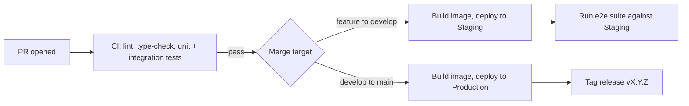

# InkFlow — CI/CD Design

**Author:** Technical Architect
**Version:** 1.0
**Date:** 2026-07-01
**Status:** Draft — Awaiting Review
**Builds on:** Branching Strategy (Deliverable 6 — `develop`/`main` mapping), Development Environment (Deliverable 10)

---

## Purpose

How code gets from a merged PR to a running system, automatically. Directly operationalizes Branching Strategy's environment mapping — this is where `develop`→Staging and `main`→Production actually happen.

**Scope note up front:** Monitoring and backups are intentionally scoped thin here — tool and destination chosen, not dashboards or alert thresholds, since there's nothing running yet to calibrate those against. Flagging this so it reads as deliberate, not incomplete.

---

## 1. Pipeline Overview

## 2. GitHub Actions Workflows

| Workflow | Trigger | Does |
|---|---|---|
| `ci.yml` | Every PR, any branch | Lint (ruff, eslint), type-check (mypy, tsc), unit + integration tests. Must pass before merge (Branching Strategy §3). |
| `deploy-staging.yml` | Push to `develop` | Build Docker images, push to registry, deploy to Staging (Azure Container Apps), run `e2e/` suite against the live Staging URL |
| `deploy-production.yml` | Push to `main` | Build Docker images, push to registry, deploy to Production, create git tag (Branching Strategy §4) |

## 3. Docker Images & Registry

**Azure Container Registry (ACR)** — same cloud as compute (ADR-005), avoids cross-cloud image pulls. Images tagged with the git SHA on every build (`api:a1b2c3d`) plus `latest` on Staging and the semver tag on Production releases — SHA tagging means any deployed image is traceable to an exact commit, not just "whatever latest happened to be."

## 4. Environments

| Environment | Branch | Compute | Database |
|---|---|---|---|
| Development | (local) | Docker, local | Supabase — dev project (free tier) |
| Staging | `develop` | Azure Container Apps | Supabase — shared dev/staging project (free tier) |
| Production | `main` | Azure Container Apps | Supabase — dedicated project, **paid tier** |

**Why Dev and Staging share a Supabase project, but Production doesn't:** three fully separate projects is the textbook-correct answer, but at solo-developer scale, Staging mainly exists as a pre-Production smoke-test step, not an environment other people rely on being pristine — sharing with Dev is a reasonable simplification. Production gets full isolation and its own paid tier regardless, both for real backups (ADR-004 already flagged the free tier has none) and so nothing in Dev/Staging can ever touch real customer data. Split Staging out into its own project later if it starts getting in Dev's way.

## 5. Secrets Management

- GitHub Actions **encrypted secrets**, scoped per environment (Staging secrets and Production secrets are separate GitHub Environments, not one shared secret set) — a Staging deploy physically cannot see a Production credential.
- Never in code, never in `.env` files committed to the repo (Coding Standards §8 already establishes this; restating because CI/CD is where it'd actually leak if someone got sloppy).
- Rotation policy and a dedicated secrets manager (e.g., Azure Key Vault) are real future needs, not needed to start — noted so it's not forgotten, not built prematurely.

## 6. Monitoring & Logging

**Tool:** Azure Monitor / Application Insights, since it's native to Azure Container Apps (ADR-005) and requires near-zero setup to start collecting logs and basic metrics (request rate, error rate, latency).

**What connects to what:** the structured JSON logs from Handbook §6 / Coding Standards §6 (`structlog`) flow into Azure Monitor's Log Analytics automatically once the Container App is configured to ship stdout — no separate logging agent to install.

**Deliberately not decided yet:** specific alert thresholds, dashboards, on-call anything. There's no traffic pattern to calibrate against yet — designing alert thresholds against zero real usage data would be guessing, not deciding.

## 7. Backups

Handled by moving Production's Supabase project to a **paid tier** before launch (ADR-004's flag, now actioned) — Supabase Pro includes automated daily backups with point-in-time recovery. No custom backup tooling to build; this is exactly the "managed service for a solved problem" principle.

**Deliberately not decided yet:** a written restore runbook — worth having before Production actually has real user data, not before.

## 8. Deployment Strategy

**Simple rolling update** (Azure Container Apps' default) — old revision drains as new revision comes up, brief overlap, no downtime for typical deploys.

**Why not blue/green or canary:** those solve risk-reduction problems for high-traffic systems where a bad deploy needs to be caught and rolled back before it affects most users. At ~1,000 users with a single developer shipping, a rolling update plus a fast manual rollback (redeploy the previous image tag) is proportionate. Revisit if deploy frequency and user count both grow enough that blast radius actually matters.

## 9. Explicitly Out of Scope (confirmed, not revisited here)

- Kubernetes — Azure Container Apps is sufficient at this scale (Deliverable 2, ADR-005).
- Kafka / Camunda — excluded from Phase 1 (Deliverable 2, ADR-007); still a valid Phase 2 learning spike.

---

## Architecture Decision Records

### ADR-023: Rolling Deploys, No Blue/Green or Canary
**Decision:** Use Azure Container Apps' default rolling update strategy for both Staging and Production deploys.
**Why:** Blue/green and canary strategies exist to de-risk deploys at a traffic/team scale where a bad release affecting even a small percentage of users for a few minutes is a real problem worth the infrastructure cost. That's not InkFlow's situation yet.
**Alternative considered:** Blue/green — rejected as unneeded operational complexity for the current scale; revisit if deploy frequency or user count grows enough to justify it.

### ADR-024: Shared Dev/Staging Supabase Project, Isolated Production
**Decision:** One Supabase project serves both local Development and Staging; Production gets its own dedicated, paid-tier project.
**Why:** Full three-way isolation is the textbook pattern, but Staging's actual job here — a pre-Production smoke test — doesn't need protection from Dev the way Production needs protection from both. Simplifies setup for a solo developer without weakening the one isolation boundary that actually matters (Production never touches non-Production data).
**Alternative considered:** Three fully separate projects — rejected as unnecessary overhead now; easy to split later since Supabase projects are cheap to add.

---

## Open Items Carried Forward

- **Actual GitHub Actions YAML files** — first implementation task once this deliverable and Testing Strategy (12) are both approved (CI needs to know what tests to run).
- **Branch protection rule configuration** (required checks, required reviewers) — carried from Branching Strategy, actioned here.

---

*Next: Deliverable 12 — Testing Strategy.*
