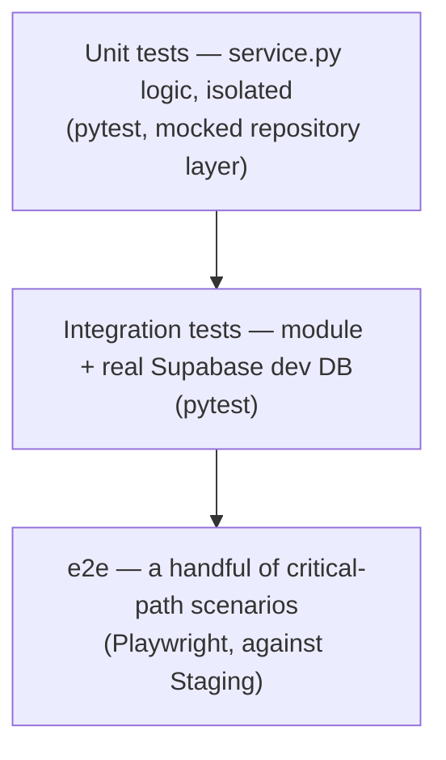

# InkFlow — Testing Strategy

**Author:** Technical Architect
**Version:** 1.0
**Date:** 2026-07-01
**Status:** Draft — Awaiting Review
**Builds on:** Engineering Handbook §12 (philosophy), CI/CD Design (Deliverable 11 — where these gates actually run)

---

## Purpose

The Handbook (§12) already stated the philosophy — test pyramid, "done means tested," dedicated tests for fiddly/concurrency-sensitive logic. This makes it concrete: tools, coverage targets, and exactly which paths are non-negotiable regardless of overall coverage percentage.

**Scope note up front:** performance and security testing are deliberately thin here — deferred, not forgotten, and explained below rather than silently absent.

---

## 1. Test Pyramid, Concretely

Most tests are unit tests. Integration tests cover a module's actual DB interaction (repository.py + real Postgres, since RLS behavior specifically needs a real Postgres to test against — a mocked DB can't validate a security policy). E2E is reserved for the few flows where only "does the whole system actually work end to end" answers the question.

## 2. Tools

| Layer | Tool | Why |
|---|---|---|
| Backend unit/integration | `pytest` + `pytest-asyncio` | The standard for async Python; no real alternative worth considering |
| Frontend unit/component | `Vitest` + React Testing Library | Vitest is the current mainstream default for Vite/Next.js-adjacent projects — faster than Jest, near-identical API, less config |
| End-to-end | `Playwright` | Better multi-browser support and a more modern API than Cypress; also runs headless in CI without extra tooling |

## 3. Coverage Targets — Pragmatic, Not a Vanity Number

| Area | Target |
|---|---|
| `service.py` (business logic, BR-XX enforcement) | 80%+ — this is where bugs actually cost you |
| `router.py` (thin HTTP passthrough) | No specific target — if it's genuinely thin, there's not much to cover |
| `repository.py` | Covered indirectly via integration tests, not unit-mocked in isolation |
| Frontend components | No blanket target — test behavior that matters (form validation, signature capture), not every render |
| e2e | Not coverage-driven at all — a fixed, curated list of critical paths (below), not "cover more scenarios over time" |

**Why not a single project-wide number (e.g., "90% coverage"):** a blanket target incentivizes testing easy, low-value code to hit the number rather than testing what's actually risky — exactly the kind of vanity metric the Handbook's "test the business rule, not just the code path" principle warns against.

## 4. Non-Negotiable Tests (Regardless of Coverage %)

These get dedicated, isolated tests before anything else, because they're exactly the kind of logic that looks obviously correct and isn't — all flagged during Deliverable 2:

- **Token consumption atomicity** — concurrent double-submit on the same signing token must result in exactly one success, one 409 (Deliverable 2, Batch 4 §2). Test with genuinely concurrent requests, not sequential calls that happen to hit the same code path.
- **Sequential signing order** — signer N+1 is never notified before signer N completes; verify via the DB state, not just that an email-send function was called.
- **Decline pauses the entire envelope** — including already-notified parallel signers (ADR-016), not just downstream sequential ones. Easy to accidentally implement the narrower, wrong version.
- **Coordinate conversion math** — the top-left-to-bottom-left PDF coordinate flip (Batch 4 §4), tested in isolation against known input/output pairs before it's wired into the full PDF pipeline.
- **RLS / tenant isolation** — a dedicated test class that attempts cross-company reads/writes for every RLS-protected table and asserts they fail. This is R-07 (Critical risk) made concrete as an actual test, not just a policy definition trusted to work.
- **PDF generation smoke test** — the completed PDF actually opens, has the right page count, and the audit page is the final page. Not pixel-perfect visual testing, just "did this not silently produce garbage."

## 5. Quality Gates (enforced in CI, Deliverable 11)

- **Every PR → `develop`:** lint, type-check, unit tests, integration tests must all pass. No merge otherwise (Branching Strategy §3).
- **`develop` deploy → Staging:** e2e suite runs against the live Staging deployment (not local) — catches real integration issues (actual Supabase, actual SendGrid) that mocked tests can't.
- **`develop` → `main` promotion:** requires the last Staging e2e run to be green. A red e2e run blocks promotion until fixed, full stop.

## 6. Security Testing — Deliberately Thin, Not Absent

Full scope (dependency scanning, pen-testing cadence) is more than a pre-launch MVP needs to design in detail. Two things worth doing **now** specifically because they're free and require zero ongoing design work:

- **GitHub Dependabot** — enabled from day one. Automatic PRs for vulnerable dependencies, no configuration burden.
- **GitHub CodeQL** — enabled from day one. Static analysis for common vulnerability patterns, runs in CI automatically.

Beyond that, the RLS/tenant-isolation test class above **is** the meaningful security test for Phase 1 — it directly tests the Critical-impact risk the product doc flags (R-07). A dedicated pen-test or fuzzing setup is a reasonable pre-Production-launch task, not a Sprint 0 one.

## 7. Performance Testing — Explicitly Deferred

Not designed here. Load-testing thresholds decided against a system with zero real traffic would be guesses dressed up as a plan. Revisit once there's actual usage data (even Staging usage) to calibrate against — likely a Deliverable owned closer to launch, not Sprint 0.

---

## Architecture Decision Records

### ADR-025: Playwright for End-to-End Tests
**Decision:** Playwright, not Cypress, for the `e2e/` suite.
**Why:** Better native multi-browser support (Chromium, Firefox, WebKit from one config) and a more modern async API; runs cleanly headless in GitHub Actions without extra plugins Cypress often needs for the same result.
**Alternative considered:** Cypress — rejected as a fine but slightly dated choice next to Playwright's current ecosystem position; both would have worked, this is a mild preference more than a hard technical requirement.

---

## Open Items Carried Forward

- **Pen-testing/fuzzing setup** — pre-Production-launch task, not Sprint 0.
- **Load/performance testing** — once real usage data exists to calibrate against.
- **Test data seeding strategy for integration tests** — first implementation task once this is approved, alongside Deliverable 10's dev environment setup.

---

## Sprint 0 — Status

With this deliverable, everything explicitly assigned to the Technical Architect in this chat is done:

| # | Deliverable | Status |
|---|---|---|
| 2 | Architecture Diagrams | ✅ Approved |
| 3 | Engineering Handbook | ✅ Approved |
| 4 | Repository Structure | ✅ Approved |
| 5 | Coding Standards | ✅ Approved |
| 6 | Branching Strategy | ✅ Approved |
| 8 | API Conventions | Awaiting review |
| 10 | Development Environment | Awaiting review |
| 11 | CI/CD Design | Awaiting review |
| 12 | Testing Strategy | Awaiting review |

**Still open, not forgotten:** Deliverable 7 (Documentation Templates — PM + Documentation Engineer + Architect) and Deliverable 9 (Project Management Setup — PM + EM, previously flagged as parallelizable, no dependency on anything above).

---

*Pending your review of all four.*
