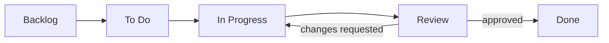

# InkFlow — Project Management Setup

**Author:** Product Manager (with Engineering Manager)
**Version:** 1.0
**Date:** 2026-07-01
**Status:** Draft — Awaiting Review
**Builds on:** Product Vision v1.3, Engineering Handbook (Deliverable 3), Branching Strategy (Deliverable 6)

---

## Purpose

Deliverable 9 exists to answer one question: **where does work live, and how does it move from "idea" to "done"?** Everything here is scoped for how this project actually runs — one human developer directing multiple AI engineering roles across separate chats, not a multi-person team needing coordination overhead. Where a standard Agile/Scrum practice would add ceremony without adding clarity at this scale, it's deliberately left out.

This deliverable doesn't repeat what's already decided elsewhere — it points to it:
- **What gets built and why** → Product Vision.
- **How code is reviewed, branched, and merged** → Engineering Handbook §8–9, Branching Strategy.
- **What "done" means at the code level** (lint, tests, ADR alignment) → those same documents.

This deliverable is specifically about the **tracking layer** sitting on top of that: the board, the ticket, the sizing, the rhythm.

---

## 1. Kanban Board (GitHub Projects)

**Tool: GitHub Projects** (the built-in board, tied directly to the `inkflow` repo's issues and PRs). No separate tool (Jira, Linear, Trello) — the work items already live where the code lives, and GitHub Projects auto-links issues to the PRs that close them. Introducing a second tool would mean manually keeping two systems in sync for zero real benefit at this scale.

### Columns

| Column | Meaning |
|---|---|
| **Backlog** | Captured, not yet ready to work on. May be missing detail, a design decision, or a dependency. |
| **To Do** | Meets Definition of Ready (Section 3). Could be picked up next. |
| **In Progress** | Actively being worked — by you directly, or by an AI engineering role in an active chat/session. |
| **Review** | Work is done from the implementer's side and is in a PR awaiting the Handbook §9 checklist pass (self/AI review, and Architecture Reviewer pass if the PR touches a flagged category per Branching Strategy §3). |
| **Done** | Merged and, where applicable, deployed to Staging. |

**No WIP limits.** WIP limits solve a coordination problem for teams working in parallel — with one person directing the work, the natural constraint is already "how many things can I actually review and merge in a day," which doesn't need a formal cap to enforce.

**Card → Branch → PR linkage:** every card that reaches "In Progress" should have a matching `feature/*` (or `hotfix/*`) branch per Branching Strategy §1's naming convention. Opening a PR against that branch and linking it to the issue moves the card to Review automatically (GitHub Projects' built-in automation); merging moves it to Done.

### Board View



---

## 2. Labels

A small, deliberately flat label set — enough to filter the board, not a taxonomy to maintain.

| Category | Labels |
|---|---|
| **Type** | `feature`, `bug`, `chore`, `docs`, `spike` |
| **Size** | `size:S`, `size:M`, `size:L` (Section 5) |
| **Module** | `identity`, `envelope`, `signing`, `docgen`, `audit`, `notification`, `storage`, `frontend`, `infra` — matches the module map from Deliverable 2/4 |
| **Priority** (optional, backlog grooming only) | `priority:now`, `priority:next`, `priority:later` |

**Not doing:** per-role labels (`role:backend-engineer`, etc.). The `module` label already implies which engineering role owns it (Repository Structure's Directory Ownership Table, Deliverable 4 §6, is the source of truth for that mapping) — a second label saying the same thing is redundant.

---

## 3. Definition of Ready (DoR)

A card can move from **Backlog → To Do** when all of these are true:

- [ ] The card describes a single, concrete piece of work (not "improve envelope handling" — see the template's Acceptance Criteria requirement, Section 6).
- [ ] Acceptance criteria are written and specific enough that "done" is checkable, not a judgment call.
- [ ] Any Business Rule (BR-XX) or Feature (F-XX) it implements is referenced, if applicable.
- [ ] It doesn't depend on an undecided product or architecture question — if it does, it stays in Backlog until that's resolved (Product Vision or the relevant Deliverable is the source of truth).
- [ ] A rough size estimate has been assigned (Section 5).
- [ ] The module/owning role is labeled, so it's clear who (which AI role, or you directly) picks it up.

If any box is unchecked, the card stays in Backlog — that's what Backlog is for, not a failure state.

---

## 4. Definition of Done (DoD)

A card can move to **Done** when all of these are true:

- [ ] Code merged to `develop` (or `main`, for a hotfix) per Branching Strategy's merge rules.
- [ ] CI passing (lint, type-check, tests) — Branching Strategy §3, enforced by branch protection.
- [ ] PR reviewed against the Engineering Handbook §9 checklist (module boundaries, ADR alignment, input validation, error handling, tests) — self/AI review at minimum; Architecture Reviewer pass for anything touching shared boundaries, security-sensitive code, or a new dependency (Branching Strategy §3's escalation categories).
- [ ] Acceptance criteria from the card (Section 3) are actually met — not just "code exists," but the behavior described is true.
- [ ] Tests exist for the new/changed behavior, per Handbook §12 and Testing Strategy's non-negotiable list where applicable.
- [ ] Documentation updated if the change affects it (README, docstrings, ADR) — Handbook §10.
- [ ] No open TODO/FIXME left in the diff without a corresponding follow-up card.

**Note on "Deployed":** Done means merged and CI-green, not necessarily live in Production. Once CI/CD (Deliverable 11) is running, a merge to `develop` auto-deploys to Staging as part of the normal pipeline — that's covered by the pipeline itself, not a manual DoD step here.

---

## 5. Estimation — Size, Not Points

**T-shirt sizes: S / M / L.** No story points, no velocity tracking — there's no sprint history yet to calibrate against, and for a one-person project, velocity math solves a forecasting problem that doesn't really exist here (you're not reporting a burndown to anyone).

| Size | Rough meaning | Example |
|---|---|---|
| **S** | A few hours, one sitting, one module | Add a new audit event type; write one endpoint's validation |
| **M** | The better part of a day, may touch 2–3 files/modules | Implement the decline endpoint end-to-end (router + service + repository + test) |
| **L** | Multiple days, likely spans several modules or needs its own design pass first | Sequential signing orchestration; the full PDF generation pipeline |

**If something feels bigger than L, it's not sized wrong — it's not actually one card.** Split it before it goes to To Do. This is a DoR concern (Section 3), not an estimation-scale concern — there's no XL size on purpose, to force that split conversation to happen.

Sizes are estimates for your own planning (Section 7 — how much fits in a sprint), not a commitment tracked against anyone.

---

## 6. Task / Issue Template

One template, used for everything — feature work, bugs, chores. Overhead of multiple templates (bug template vs. feature template vs. chore template) isn't worth it at this scale; the fields below flex naturally depending on type.

```markdown
## Summary
One or two sentences: what is this, and why does it matter?

## Type
feature / bug / chore / docs / spike

## Module
(identity / envelope / signing / docgen / audit / notification / storage / frontend / infra)

## Acceptance Criteria
- [ ] Specific, checkable outcome 1
- [ ] Specific, checkable outcome 2

## References
- Business Rule(s): BR-XX
- Feature: F-XX
- ADR (if relevant): ADR-XXX
- Related card(s): #

## Size
S / M / L

## Notes / Open Questions
(Anything that would block this from being Ready — flag here, don't guess.)
```

This maps directly onto the DoR checklist (Section 3) — a card can't reach "Ready" until every field above is actually filled in, not left as a placeholder.

---

## 7. Sprint Cadence

**One-week sprints.** Short enough that a sprint's scope is genuinely small and re-plannable, long enough that it's not pure overhead to open and close one. This is a default to start with — revisit if it feels wrong after a few real sprints, not a number defended in the abstract.

**Sprint start:**
1. Pull cards from Backlog into To Do based on what's Ready (Section 3) and what unblocks the most downstream work (e.g., finishing Deliverable 2 before Deliverable 4 started).
2. Write a one-line **Sprint Goal** — what should be true at the end of the week that isn't true now. Pinned as the sprint's GitHub Milestone description.
3. Rough-size the pulled cards (Section 5) if not already sized, and sanity-check total size against last sprint's actual throughput once there's a sprint or two of history — informally, not a formal velocity metric.

**Sprint end:**
1. Anything in Done gets a quick look against the Sprint Goal — did the goal actually get met, partially, or not?
2. Anything still In Progress or Review carries directly into next sprint's To Do — no formal "spillover" ceremony, it just moves.
3. Anything still in To Do but untouched goes back to a Backlog re-prioritization pass — if it didn't get picked up, ask why before automatically re-committing to it next week.

**No daily standups, no retro ceremony as a separate meeting.** For a solo developer working across AI-role chats, the equivalent of a "standup" is just opening the board — the overhead of a formal ceremony has no one else to synchronize with. If something's worth reflecting on process-wise, it goes as a note in the sprint's Milestone or as a card itself (`chore` type) — not a scheduled ritual.

---

## 8. Task Ownership

Ownership follows the Directory Ownership Table already established in Deliverable 4 §6 — restated here as it applies to board usage, not redefined:

| Module label | Owning role |
|---|---|
| `identity`, `envelope`, `signing`, `docgen`, `audit`, `notification`, `storage` | Backend Engineer |
| `frontend` | Frontend Engineer |
| `infra` | DevOps Engineer |
| (schema/migration work, any module) | Database Engineer |
| `docs` type | Documentation Engineer |
| Security-sensitive or cross-module PRs | Architecture Reviewer (review pass, not primary ownership) |

In practice, this determines **which AI role's chat a card gets handed to**, not a human team assignment. A card labeled `signing` + `feature` is worked by opening a Backend Engineer session with that card's content as the brief.

---

## Open Items Carried Forward

- **Actual GitHub Project board creation, label setup, and Milestone configuration** — first implementation task once this deliverable is approved, not a separate deliverable.
- **Issue template as a repo file** (`.github/ISSUE_TEMPLATE/task.md`) using Section 6's format — small implementation task, can be done alongside Deliverable 7's templates work.

---

*Pending your review and approval.*
