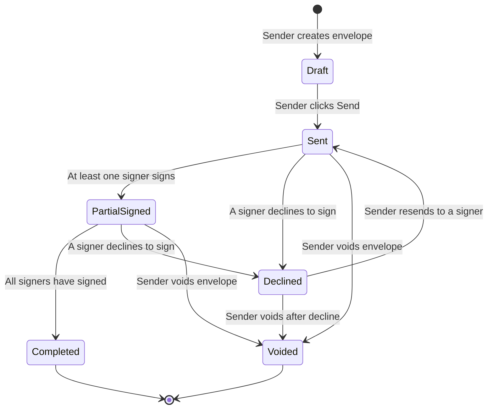
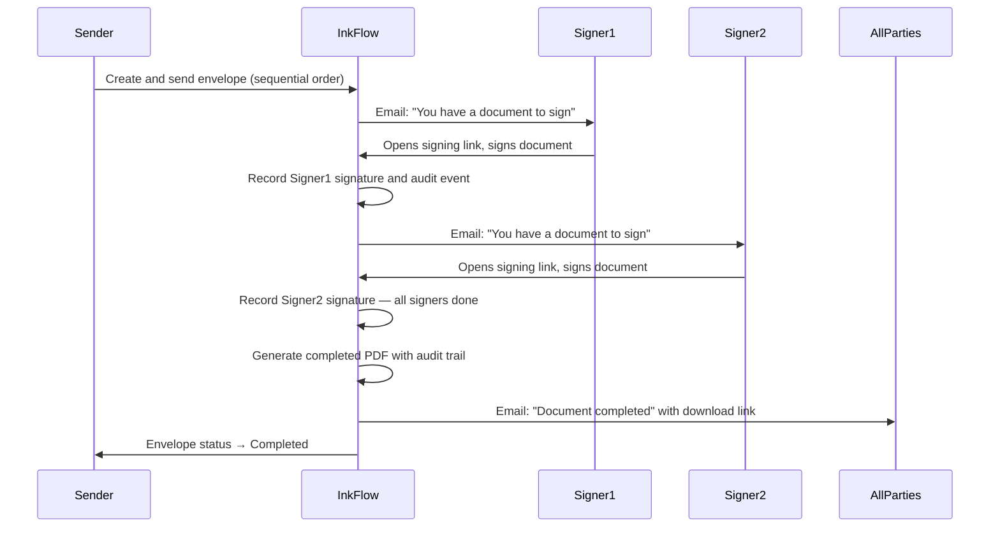
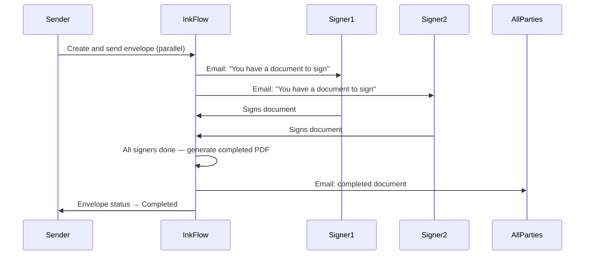

# InkFlow — Product Vision Document

**Version:** 1.3
**Date:** 2026-06-30
**Author:** Product Manager
**Status:** Approved — Ready for Architecture Handoff

**Changelog (v1.0 → v1.1):** All Sprint 1 open questions (Q-01–Q-10) answered. Architect clarification round (Q-A–Q-D) resolved. Decline-to-sign workflow added. Signer fill-in text field added to Phase 1 scope.

**Changelog (v1.1 → v1.2):** Internal recipients (Signer/CC sharing an email with a registered company user) now get read-only dashboard visibility — added to Phase 1. External recipients receive push status updates after they've signed. Auth-related business rules (BR-01/02/03) reframed as flexible guidelines to accommodate a managed auth provider, per the updated Learning Philosophy.

**Changelog (v1.2 → v1.3):** Confirmed the decline-resolution recipient-editing approach (BR-15c) is acceptable, conditional on audit trail identity snapshots being preserved (new BR-25a).

---

## Table of Contents

1. [Product Vision](#1-product-vision)
2. [MVP Scope](#2-mvp-scope)
3. [User Personas](#3-user-personas)
4. [User Roles](#4-user-roles)
5. [Company Structure](#5-company-structure)
6. [User Journeys](#6-user-journeys)
7. [Feature List](#7-feature-list)
8. [Business Rules](#8-business-rules)
9. [Signing Workflow](#9-signing-workflow)
10. [Out of Scope — Future Phases](#10-out-of-scope--future-phases)
11. [Risks and Assumptions](#11-risks-and-assumptions)
12. [Sprint 1 Questions — Answered](#12-sprint-1-questions--answered)

---

## 1. Product Vision

### Vision Statement

InkFlow is a web-based electronic signature platform that allows businesses to send, sign, and manage documents digitally — eliminating the need for printing, scanning, or in-person signing.

InkFlow is inspired by DocuSign. The Phase 1 MVP focuses on the core signing workflow: a sender uploads a document, places signature fields, sends it to one or more recipients, and receives a completed signed copy when all parties have signed.

### Problem Statement

Businesses that rely on physical signatures face delays, increased costs, and poor audit trails. Most small and mid-sized teams need a straightforward way to:

- Send documents for signature without printing.
- Allow recipients to sign from any device.
- Track document status in real time.
- Retain a complete audit trail for compliance.

### Product Goals

| Goal | Description |
|---|---|
| Simplify signing | Replace paper-based workflows with a digital process |
| Enable remote signing | Allow anyone with an email link to sign without creating an account |
| Provide visibility | Senders can track the status of every document in real time |
| Ensure accountability | Every action is recorded in an audit trail |
| Support teams | Multiple users within a company can send and manage documents |

### Guiding Principles

- The MVP should be intentionally small and complete, not feature-rich.
- Core workflows should work reliably before additional features are introduced.
- The signing experience for recipients must require no account creation.
- Security and audit trails are non-negotiable from day one.

---

## 2. MVP Scope

The Phase 1 MVP covers exactly one end-to-end workflow: **send a document → sign a document → complete the envelope**.

### In Scope for Phase 1

| Area | Included |
|---|---|
| Authentication | Email + password login for registered users |
| Document Upload | Upload a PDF for signing |
| Field Placement | Place signature, date, and recipient text fields on the document |
| Envelope Creation | Create an envelope and assign recipients (drafts are fully editable before sending) |
| Recipient Notifications | Email notification with a signing link (expires in 7 days) |
| Signing Experience | Recipients sign via a web browser without registering; may decline with a comment |
| Completion | Completed PDF delivered to sender and all signers |
| Audit Trail | Log of all document events (sent, viewed, signed, completed) |
| Dashboard | Sender sees status of all envelopes |
| Company Accounts | Multiple users under a single company account |
| User Management | Company Admin can invite and deactivate users |

### Phase 1 is NOT

- A full document management system.
- A template library.
- An API platform for third-party integrations.
- A mobile application.

---

## 3. User Personas

### Persona 1 — Sarah, the Office Manager

| Attribute | Detail |
|---|---|
| **Name** | Sarah Chen |
| **Role** | Office Manager at a 30-person accounting firm |
| **Age** | 38 |
| **Technical skill** | Moderate — comfortable with web apps, not technical |
| **Goal** | Send contracts and NDAs to clients quickly and without printing |
| **Pain point** | Chasing clients to return signed PDFs by email — documents get lost |
| **Frequency of use** | Sends 10–20 envelopes per week |

Sarah creates envelopes, uploads PDFs, places signature fields, and sends them to clients. She monitors progress from her dashboard and follows up when documents are incomplete.

---

### Persona 2 — James, the Recipient / Signer

| Attribute | Detail |
|---|---|
| **Name** | James Okafor |
| **Role** | Client of Sarah's firm |
| **Age** | 45 |
| **Technical skill** | Basic — uses email and a smartphone |
| **Goal** | Sign a document quickly and move on |
| **Pain point** | Complicated signing tools that require account creation |
| **Frequency of use** | Signs 1–2 documents per month |

James receives an email with a signing link. He clicks the link, reviews the document, signs in his browser, and receives a confirmation. He never creates an account.

---

### Persona 3 — Alex, the Company Admin

| Attribute | Detail |
|---|---|
| **Name** | Alex Rivera |
| **Role** | IT Manager / Operations Lead |
| **Age** | 32 |
| **Technical skill** | High — manages software tools for the business |
| **Goal** | Set up InkFlow for the team, manage users, and ensure proper access control |
| **Pain point** | Tools that don't allow centralized team management |
| **Frequency of use** | Weekly — manages accounts, reviews usage |

Alex registers the company on InkFlow, invites team members, assigns roles, and deactivates users when they leave.

---

### Persona 4 — Maria, the Team Member / Sender

| Attribute | Detail |
|---|---|
| **Name** | Maria Santos |
| **Role** | Sales representative |
| **Age** | 27 |
| **Technical skill** | Moderate |
| **Goal** | Send sales contracts for signature without involving IT |
| **Pain point** | Waiting for the admin to send documents on her behalf |
| **Frequency of use** | 5–10 envelopes per week |

Maria is a standard user under the company account. She can upload documents, create envelopes, and send them independently within her account.

---

## 4. User Roles

InkFlow has two layers of roles: **Platform Roles** (within the application) and **Envelope Roles** (within a signing workflow).

### 4.1 Platform Roles

| Role | Description |
|---|---|
| **Company Admin** | Manages the company account, users, and billing. Full access to all envelopes within the company. |
| **Sender** | A registered user who can create and send envelopes. Can only see their own envelopes unless elevated. |
| **Recipient** | A person assigned as a Signer or CC on an envelope. Always interacts via a secure signing/access link, regardless of account status. |

> **Note:** In Phase 1, there is no Viewer-only or Manager role. All registered users are Senders. The Company Admin has elevated permissions.

> **Internal Recipients:** If a Recipient's email matches a registered user in the same company (e.g., a Sender CCs their CEO, who also has an InkFlow login), that person is still emailed the standard signing/access link — the signing experience does not change. In addition, they get read-only visibility into that specific envelope (status + audit trail) from their own dashboard, since they're already an authenticated platform user. This is a Phase 1 feature — see F-19a / BR-15b.

### 4.2 Envelope Roles

| Role | Description |
|---|---|
| **Envelope Owner / Sender** | The registered user who created the envelope. Can void or resend. |
| **Signer** | A recipient assigned a signature field. Must sign to complete the envelope. |
| **CC Recipient** | Receives a copy of the completed document but does not sign. *(Phase 1 inclusion — no action required from them.)* |

### 4.3 Permission Matrix

| Action | Company Admin | Sender (own envelopes) | Recipient |
|---|---|---|---|
| Register company | ✅ | ❌ | ❌ |
| Invite users | ✅ | ❌ | ❌ |
| Deactivate users | ✅ | ❌ | ❌ |
| Upload document | ✅ | ✅ | ❌ |
| Create envelope | ✅ | ✅ | ❌ |
| Send envelope | ✅ | ✅ | ❌ |
| Void envelope | ✅ (any company envelope) | ✅ (own only) | ❌ |
| View all company envelopes | ✅ | ❌ | ❌ |
| View own envelopes | ✅ | ✅ | ❌ |
| Sign document | ❌ | ❌ | ✅ |
| Decline to sign (with comment) | ❌ | ❌ | ✅ |
| View read-only status + audit trail of an envelope they're a Recipient on | ➖ (already covered by full access) | ➖ (already covered if also owner) | ✅ — only if Recipient's email matches a registered company user |
| Download completed document | ✅ (via platform) | ✅ (via platform) | ✅ (via emailed link) |

---

## 5. Company Structure

InkFlow is a **multi-tenant** platform. Each company is an isolated account. Users belong to exactly one company.

```
InkFlow Platform
└── Company (Tenant)
    ├── Company Admin (1 or more)
    └── Senders (0 or more)
```

### Company Account Rules

- A company is created when the first Admin registers.
- A Company Admin invites additional users by email.
- Invited users register and are automatically associated with the company.
- Users cannot belong to more than one company in Phase 1.
- Deactivated users cannot log in but their envelope history is retained.
- A company must always have at least one active Admin.

### Registration Flow

```
Admin registers with company name and email
→ Company account created
→ Admin account created and linked to company
→ Admin can invite additional users
```

---

## 6. User Journeys

### Journey 1 — Company Admin Onboarding

```
1. Admin visits InkFlow and clicks "Register"
2. Admin enters: Full name, Email, Password, Company name
3. Account created — Admin is logged in
4. Admin lands on Dashboard (empty state)
5. Admin navigates to User Management
6. Admin invites a team member by email
7. Team member receives invitation email
8. Team member clicks link, sets password, and is logged in
9. Team member is now an active Sender on the account
```

---

### Journey 2 — Sender Creates and Sends an Envelope

```
1. Sender logs in and clicks "New Envelope"
2. Sender uploads a PDF document
3. Sender names the envelope (e.g., "NDA - James Okafor - June 2026")
4. Sender adds recipients:
   - Recipient name
   - Recipient email
   - Role: Signer or CC
   - Signing order (if sequential)
5. Sender is taken to the document editor
6. Sender places fields on the document:
   - Signature field (assigned to a signer)
   - Date Signed field (auto-populated on signing)
   - Text field (optional — e.g., "Printed Name", filled in by the signer during signing)
7. Sender can edit any part of the Draft (recipients, fields, document) at any point before sending
8. Sender reviews and clicks "Send"
9. Recipients receive email notifications with their signing links (valid for 7 days)
10. Envelope status changes to "Sent"
```

---

### Journey 3 — Recipient Signs a Document

```
1. Recipient receives email: "You have a document to sign"
2. Recipient clicks "Review and Sign" link
3. Recipient is taken to the InkFlow signing page (no login required)
4. Recipient reviews the document
5. Recipient fills in any text fields assigned to them (e.g., printed name)
6. Recipient clicks on the signature field
7. A signature modal appears with options:
   - Type name (styled as a signature)
   - Draw signature (freehand)
8. Recipient confirms and applies signature
9. Date Signed field is automatically populated
10. Recipient clicks "Finish"
11. Recipient sees a confirmation screen
12. Recipient (no account) receives a completion email containing a download link to the signed PDF
13. As remaining signers complete the envelope, this recipient receives short status update emails (e.g., "2 of 3 have signed") until the envelope is fully completed
```

---

### Journey 3c — Internal Recipient Views Envelope Status on Their Dashboard

```
1. Maria sends an envelope and CCs Alex (Company Admin), who shares his email with his InkFlow login
2. InkFlow detects Alex's recipient email matches a registered company user
3. Alex receives the standard email with his access link, same as any recipient
4. In addition, the envelope now appears on Alex's own InkFlow dashboard in a read-only state
5. Alex can view the envelope's status and full audit trail from his dashboard at any time
6. Alex cannot edit, void, resend, or otherwise act on the envelope unless he is also the owner or a Company Admin exercising admin permissions
```

---

### Journey 3b — Recipient Declines to Sign

```
1. Recipient opens their signing link
2. Recipient clicks "Decline to Sign"
3. Recipient is required to enter a comment explaining why
4. Recipient confirms decline
5. That recipient's signing link is deactivated
6. Sender receives an email: "A recipient has declined to sign" (includes the comment)
7. Envelope pauses — sender must decide next action: void the envelope, or resend to the same or a different signer
8. If the envelope used sequential signing, downstream signers do not receive their notification until the sender resolves the decline
```

---

### Journey 4 — Sender Monitors and Receives Completed Envelope

```
1. Sender views Dashboard — envelope shows status "Sent" or "Partially Signed"
2. Sender receives an email each time an individual signer signs ("James Okafor has signed")
3. Sender can see which recipients have signed and which have not
4. When all required signers have signed:
   - Envelope status changes to "Completed"
   - Sender receives email: "Your envelope has been completed" (platform notification, no attachment)
   - Completed PDF is available for download from the Dashboard (platform access only)
5. Sender can view the audit trail for the envelope
```

---

### Journey 5 — Sender Voids an Envelope

```
1. Sender opens an in-progress envelope from the Dashboard
2. Sender clicks "Void Envelope"
3. Sender provides a void reason (required)
4. All recipients receive an email notification: "This envelope has been voided"
5. Signing links are deactivated
6. Envelope status changes to "Voided"
```

---

## 7. Feature List

Features are categorised as **Must Have** (MVP) or **Should Have** (Phase 1 enhancement if time allows).

### Authentication and User Management

| # | Feature | Priority |
|---|---|---|
| F-01 | User registration (Admin) | Must Have |
| F-02 | Email and password login | Must Have |
| F-03 | Logout | Must Have |
| F-04 | Invite user by email | Must Have |
| F-05 | Accept invitation and set password | Must Have |
| F-06 | Deactivate user | Must Have |
| F-07 | Password reset via email | Must Have |
| F-08 | View user list (Admin only) | Must Have |

### Envelope Management

| # | Feature | Priority |
|---|---|---|
| F-09 | Create new envelope | Must Have |
| F-10 | Upload PDF document | Must Have |
| F-11 | Name the envelope | Must Have |
| F-12 | Add recipients (name, email, role) | Must Have |
| F-12a | Detect when a recipient's email matches a registered company user and link them | Must Have |
| F-13 | Set signing order (sequential or parallel) | Must Have |
| F-14 | Place signature fields on document | Must Have |
| F-15 | Place date signed fields on document | Must Have |
| F-15a | Place text fields on document (e.g., "Printed Name") for signer fill-in | Must Have |
| F-15b | Edit Draft envelope (recipients, fields, document) before sending | Must Have |
| F-16 | Send envelope | Must Have |
| F-17 | Void envelope (with reason) | Must Have |
| F-18 | Resend notification email to recipient | Must Have |
| F-19 | View envelope detail and status | Must Have |
| F-19a | Internal Recipient: read-only dashboard visibility (status + audit trail) into envelopes they're a Signer/CC on | Must Have |
| F-20 | View sender dashboard (envelope list) | Must Have |

### Signing Experience

| # | Feature | Priority |
|---|---|---|
| F-21 | Recipient signing page (no login required) | Must Have |
| F-22 | Type-to-sign (styled name) | Must Have |
| F-23 | Draw-to-sign (freehand canvas) | Must Have |
| F-24 | Auto-populate date signed field | Must Have |
| F-24a | Recipient fills in assigned text field(s) (e.g., printed name) | Must Have |
| F-24b | Recipient declines to sign with a mandatory comment | Must Have |
| F-25 | Recipient confirmation screen after signing | Must Have |

### Notifications

| # | Feature | Priority |
|---|---|---|
| F-26 | Send signing request email to recipient | Must Have |
| F-27 | Send platform notification email to sender on each individual signature (partial completion) | Must Have |
| F-28 | Send completion email to sender (platform notification, no attachment) | Must Have |
| F-29 | Send completion email with download link to all signers (no-account access) | Must Have |
| F-29a | Send completion email with download link to CC recipients | Must Have |
| F-29b | Send status update email to already-signed external recipients each time another signer completes (push) | Must Have |
| F-30 | Send void notification email to all recipients | Must Have |
| F-30a | Send decline notification email to sender (includes recipient's comment) | Must Have |
| F-31 | Send reminder email (manual trigger by sender) | Must Have |

### Documents and Audit

| # | Feature | Priority |
|---|---|---|
| F-32 | Generate completed PDF with signatures embedded | Must Have |
| F-33 | Download completed document (platform access for registered users) | Must Have |
| F-33a | Re-issue download link on demand for external recipients ("resend my copy") | Must Have |
| F-34 | Audit trail per envelope (event log) | Must Have |
| F-35 | View audit trail from envelope detail page | Must Have |

---

## 8. Business Rules

### Authentication

> **Note on BR-01–BR-03:** These reflect the product's intent (reasonably strong passwords; time-bounded invite and reset links), not exact contractual values. Per the project's Learning Philosophy, auth/login/invites are not InkFlow-specific and are likely to be built on a managed provider (e.g., Auth0, Clerk). The figures below are guidelines; the Architect may adopt the chosen provider's defaults as long as they stay within a reasonable security range (passwords no shorter than ~8 characters; invite links bounded to a few days; reset links bounded to roughly an hour).

- BR-01: Passwords should be at least 10 characters, or the managed auth provider's equivalent reasonable default.
- BR-02: Invitation links should expire within a few days (guideline: 72 hours), or the provider's equivalent default.
- BR-03: Password reset links should expire within roughly an hour, or the provider's equivalent default.
- BR-04: A deactivated user cannot log in.
- BR-05: A company must always retain at least one active Admin.

### Envelopes

- BR-06: An envelope must have at least one Signer recipient to be sent.
- BR-07: Every Signer must have at least one signature field assigned to them.
- BR-08: An envelope cannot be sent without at least one signature field placed on the document.
- BR-09: An envelope in "Completed" or "Voided" status cannot be modified.
- BR-10: Only the envelope owner or a Company Admin may void an envelope. A Company Admin may void any envelope within their company, regardless of which Sender created it.
- BR-11: A void reason is required when voiding an envelope.
- BR-12: An envelope cannot be voided after it has reached "Completed" status.
- BR-12a: A Draft envelope is fully editable by its owner — recipients, fields, and the source document can all be changed before it is sent.
- BR-12b: An envelope may have a maximum of 30 recipients (combined Signers and CC).
- BR-12c: Uploaded documents must be PDF format only, with a maximum file size of 25 MB.
- BR-12d: The sender may optionally include themselves as a Signer on their own envelope. Sender self-signing is never required.
- BR-12e: If a Recipient's email matches a registered user within the same company, that user gets read-only visibility (status + audit trail) of that specific envelope on their own dashboard, in addition to receiving the standard email-based signing/access link. This does not grant any edit, void, or resend permission — those still require being the envelope owner or a Company Admin.

### Signing Order

- BR-13: If signing order is **sequential**, the next signer receives their notification only after the previous signer has completed signing.
- BR-14: If signing order is **parallel**, all signers receive notifications simultaneously.
- BR-15: CC recipients always receive the completed document after all signers have signed. They do not receive a signing request. CC recipients have no platform account and receive their copy via an emailed download link, the same mechanism used for external Signers.
- BR-15a: If a Signer declines to sign, that signer's branch pauses. The envelope does not auto-void. The sender is notified (including the recipient's comment) and must manually choose to void the envelope or resend to a signer. In a sequential envelope, downstream signers do not receive notifications while a decline is unresolved.
- BR-15c: When a sender resolves a decline by resending to a *different* signer, the existing Recipient record may be updated in place (name/email changed) rather than replaced with a new record. This is a narrow exception scoped only to decline-resolution — no other business rule permits editing recipient details after Send (see BR-09/BR-12a). This is acceptable only because of BR-25a (below): the audit trail is unaffected by this edit.

### Signing

- BR-16: A recipient's signing link is unique, tied to their email address, and expires 7 days after the envelope is sent. The link may be opened/viewed multiple times (each generating an `envelope.viewed` audit event) up until the recipient submits their signature or decline, at which point it becomes permanently invalid.
- BR-17: Once a recipient has signed, they cannot modify their signature.
- BR-18: A signing link becomes invalid after the envelope is voided, completed, declined by that recipient, or its 7-day expiry passes.
- BR-19: Recipients do not need to create an InkFlow account to sign.
- BR-20: The date signed field is always populated automatically with the UTC date at the time of signing. Recipients cannot change it.
- BR-20a: A recipient may decline to sign. A comment is required when declining.
- BR-20b: Text fields in Phase 1 are simple, sender-labeled, single-line fields filled in by the recipient during signing (e.g., "Printed Name"). They carry no validation rules or conditional logic — that is deferred to Phase 2.
- BR-20c: After a Signer completes their signature, they receive a status update email each time another signer on the same envelope completes their signature, until the envelope reaches "Completed." This reuses the same per-signature notification mechanism as F-27, simply extended to already-signed external recipients.

### Completed Documents

- BR-21: A PDF is considered complete when all Signers have signed.
- BR-22: The completed PDF must have all signatures visually embedded.
- BR-23: The audit trail must be appended as the final page of the completed PDF.
- BR-23a: Registered users (Senders, Admins) access completed documents only through the InkFlow platform — never via an emailed attachment or unauthenticated link.
- BR-23b: External recipients (Signers and CC) without an account access their completed document via an emailed download link. This link is not tied to the original 7-day signing token; since completed documents are retained indefinitely (BR-24), a recipient may request a new download link at any time via a "resend my copy" action.

### Data Retention

- BR-24: Completed envelopes and their documents are retained indefinitely in Phase 1. (Retention policy is a future phase concern.)
- BR-25: Voided envelopes retain their history and audit trail.
- BR-25a: Every audit trail entry permanently records the actor's identity (name/email) as it was **at the moment that event occurred**, independent of the current state of the Recipient record. If a Recipient's name or email is later changed (e.g., BR-15c's decline-resolution edit), historical audit entries must continue to reflect the original identity at the time — never the updated one. This is what makes BR-15c's in-place edit safe; if this guarantee is ever weakened, BR-15c must be revisited.

---

## 9. Signing Workflow

### Envelope Status Lifecycle



### Envelope Statuses

| Status | Description |
|---|---|
| **Draft** | Envelope created but not yet sent |
| **Sent** | Sent to recipients — no one has signed yet |
| **Partially Signed** | One or more (but not all) signers have signed |
| **Declined** | A signer has declined to sign; envelope is paused pending sender action |
| **Completed** | All signers have signed |
| **Voided** | Cancelled by the sender before completion |

---

### Sequential Signing Flow



---

### Parallel Signing Flow



---

### Decline-to-Sign Flow

```mermaid
sequenceDiagram
    participant Sender
    participant InkFlow
    participant Signer1
    participant Signer2

    Sender->>InkFlow: Create and send envelope (sequential order)
    InkFlow->>Signer1: Email: "You have a document to sign"
    Signer1->>InkFlow: Opens signing link, clicks "Decline to Sign"
    InkFlow->>Signer1: Prompts for required comment
    Signer1->>InkFlow: Submits decline with comment
    InkFlow->>InkFlow: Record envelope.declined audit event
    InkFlow->>InkFlow: Envelope status → Declined; Signer1's link deactivated
    InkFlow->>Sender: Email: "Signer1 declined to sign" (includes comment)
    Note over Sender,InkFlow: Signer2 does NOT receive a notification while declined
    Sender->>InkFlow: Sender resolves: void envelope OR resend to a signer
```

---

### Audit Trail Events

Every envelope maintains an append-only audit log.

| Event | Triggered When |
|---|---|
| `envelope.created` | Sender creates the envelope |
| `envelope.sent` | Sender sends the envelope |
| `envelope.viewed` | A recipient opens their signing link |
| `envelope.signed` | A recipient completes signing |
| `envelope.declined` | A recipient declines to sign (comment recorded) |
| `envelope.completed` | All signers have signed |
| `envelope.voided` | Sender voids the envelope |
| `envelope.resent` | Sender resends notification to a recipient |
| `envelope.download_link_reissued` | A download link is re-requested by an external recipient |

Each event records: event type, timestamp (UTC), actor (user ID or recipient email), and IP address.

---

## 10. Out of Scope — Future Phases

The following features are explicitly excluded from Phase 1. They are documented here to prevent scope creep and to inform future roadmap planning.

| Feature | Phase |
|---|---|
| Document templates (reusable) | Phase 2 |
| Bulk send (same document to many recipients) | Phase 2 |
| In-person signing mode | Phase 2 |
| SMS notifications | Phase 2 |
| Signer identity verification (ID check, KBA) | Phase 2 |
| Mobile native application (iOS/Android) | Phase 3 |
| Public API / webhooks for third-party integrations | Phase 3 |
| SSO / SAML login | Phase 3 |
| Multi-language support | Phase 2 |
| Custom branding per company | Phase 2 |
| Advanced reporting and analytics | Phase 3 |
| Document expiry dates | Phase 2 |
| Conditional fields (logic-based) | Phase 3 |
| Payments / billing integration | Phase 3 |
| Salesforce / CRM integrations | Phase 3 |
| Multiple companies per user | Phase 3 |
| Initials field (separate from signature) | Phase 2 |
| Advanced text fields (validation rules, conditional logic, multi-line) | Phase 2 |
| Checkbox fields | Phase 2 |
| Attachment fields (signer uploads supporting doc) | Phase 2 |

> **Note:** A basic single-line text field (e.g., for a signer's printed name) **is** included in Phase 1 — see F-15a / F-24a. Only validation, conditional logic, and multi-line/advanced text field types are deferred.

---

## 11. Risks and Assumptions

### Assumptions

| # | Assumption |
|---|---|
| A-01 | All documents uploaded in Phase 1 are PDFs. Other file formats (Word, Excel) are not supported. |
| A-02 | The platform will serve approximately 1,000 users in Phase 1. |
| A-03 | Signing takes place in a web browser. Mobile browser signing is supported but a native app is not built. |
| A-04 | Recipients sign using a type-to-sign or draw-to-sign method. Cryptographic certificate-based signing (e.g., PKI) is not required in Phase 1. |
| A-05 | Email delivery is the only notification channel in Phase 1. |
| A-06 | The platform operates in a single region (US) in Phase 1. |
| A-07 | InkFlow does not need to comply with eIDAS (EU) or specific industry regulations (e.g., HIPAA) in Phase 1. Basic e-signature legality (ESIGN Act / UETA) is sufficient. |
| A-08 | Each user belongs to exactly one company. |
| A-09 | CC recipients receive the completed document via the same emailed-download-link mechanism as external Signers; they do not take any signing action. |
| A-10 | The audit trail page appended to the completed PDF is sufficient for legal compliance in Phase 1. |
| A-11 | Signing links and download links are two distinct token types: signing links expire in 7 days, while download links can be re-issued indefinitely since completed documents are retained without expiry. |
| A-12 | Per the project's Learning Philosophy (favor managed services for solved problems), authentication/login/invites are likely to be built on a managed provider (e.g., Auth0, Clerk) rather than a fully custom Identity module. This does not change any product-facing behavior — only the exact values in BR-01–BR-03 may flex to the provider's defaults. The signing flow, audit trail, and PDF processing remain InkFlow-specific and custom-built regardless of this choice. |
| A-13 | The decision of which managed services to use (auth, email delivery, object storage, etc.) belongs to the Technical Architect and DevOps Engineer. This document specifies product behavior and constraints only — not implementation. |

### Risks

| # | Risk | Likelihood | Impact | Mitigation |
|---|---|---|---|---|
| R-01 | Scope creep — adding features beyond MVP | High | High | Strictly enforce the Phase 1 feature list. Document all deferred features in the roadmap. |
| R-02 | PDF rendering complexity — placing signature fields accurately across different PDF layouts | Medium | High | Validate early with a technical spike. Limit field types to Signature and Date Signed in Phase 1. |
| R-03 | Email deliverability — signing links going to spam | Medium | High | Use a reputable transactional email provider (e.g., SendGrid). Implement proper SPF/DKIM. |
| R-04 | Signing link security — links intercepted or shared | Low | High | Links are tokenised, expire 7 days after send, and become permanently invalid once a signature or decline is submitted. Technical Architect to finalize token implementation. |
| R-05 | Completed PDF generation accuracy — signatures not rendering correctly | Medium | High | Test extensively with varied PDF layouts. Prioritise accuracy over speed. |
| R-06 | Legal validity of signatures — user disputes | Low | Medium | Audit trail with timestamps and IP addresses provides reasonable evidence. Note: InkFlow is not a legal firm; consult legal advice for production use. |
| R-07 | Multi-tenancy data isolation — one company seeing another's data | Low | Critical | Technical Architect must enforce tenant isolation at the data layer. |

---

## 12. Sprint 1 Questions — Answered

All Sprint 0 open questions have been answered by the Product Manager. These answers are now reflected throughout this document (see updated Business Rules, Feature List, and Signing Workflow sections).

| # | Question | Answer |
|---|---|---|
| Q-01 | Signing link expiry? | **7 days.** See BR-16. |
| Q-02 | Must the sender sign their own document? | **No — optional.** The sender may include themselves as a Signer, but it is never required. See BR-12d. |
| Q-03 | Can a Company Admin void another Sender's envelope? | **Yes.** Admins may void any envelope within their company. See BR-10. |
| Q-04 | Completed documents: attachment or download link? | **Platform-only access for registered users; emailed download link for recipients without an account.** See BR-23a/BR-23b. |
| Q-05 | PDF upload size limit? | **25 MB, PDF only.** See BR-12c. |
| Q-06 | Can recipients decline to sign? | **Yes, with a mandatory comment, and the sender is notified.** See BR-15a, BR-20a, and the Decline-to-Sign Flow diagram. |
| Q-07 | Email sender on each signature, or only on full completion? | **Each individual signature triggers a notification to the sender**, in addition to the final completion email. See F-27. |
| Q-08 | Max recipients per envelope? | **30**, combined Signers and CC. See BR-12b. |
| Q-09 | Can drafts be edited before sending? | **Two separate things were clarified:** (1) Drafts are fully editable by the sender before sending — see BR-12a. (2) Recipients can fill in a basic text field (e.g., printed name) during signing — see BR-20b and F-15a/F-24a. |
| Q-10 | Company branding on the signing page? | **No custom branding in Phase 1.** InkFlow branding only. |

### Architect Clarification Round — Answered

The Technical Architect raised four follow-up questions while reviewing this document before starting Deliverable 2 (Architecture Diagrams). All four are now resolved and incorporated above.

| # | Question | Answer |
|---|---|---|
| Q-A | Does a decline auto-void the envelope, or pause for the sender to decide? | **Pauses.** Only that signer's branch is affected. The envelope moves to "Declined" status; the sender is notified and must manually void or resend. No auto-void. See BR-15a and the updated state diagram in Section 9. |
| Q-B | Is Q-09 about Draft editability or about signer-fillable fields — and does a fillable field conflict with the Out-of-Scope "Text input fields" entry? | **Both are in scope, and they're two different features** (see Q-09 answer above). The Out of Scope table has been corrected: a **basic** single-line text field is in Phase 1; only **advanced** text fields (validation, conditional logic, multi-line) remain deferred to Phase 2. |
| Q-C | Do CC recipients get the same emailed-download-link treatment as Signers? | **Yes**, confirmed. See A-09 and BR-15. |
| Q-D | Are download links bound to the same 7-day expiry as signing links? | **No.** Download links can be re-issued on demand indefinitely, since completed documents are retained without expiry. Signing links and download links are two distinct token types. See A-11 and BR-23b. |

All of the Architect's stated working assumptions (multi-tenancy isolation strategy, token design, PDF generation approach, S3 storage layout, auth mechanism) are confirmed as Architect-owned decisions — no further Product input needed on those.

### Architect Clarification Round 2 — Answered

A second round of questions came up while the Architect was discussing the design with the team, before Deliverable 2 diagramming began.

| # | Question | Answer |
|---|---|---|
| Q-E | Should an internal recipient (Signer/CC sharing an email with a registered company user, e.g. the CEO) get read-only dashboard visibility into an envelope, beyond the normal email signing-link flow? | **Yes — included in Phase 1.** They still get the standard email link (signing experience is unchanged), but the envelope also appears read-only on their own dashboard (status + audit trail only, no edit/void/resend). See BR-12e, F-12a, F-19a, and Journey 3c. |
| Q-F | For external recipients tracking status after they've already signed: push status emails, pull/lightweight account, or neither? | **Push, for Phase 1** — confirming the Architect's recommendation. Already-signed external recipients get a short status update email each time another signer completes, reusing the per-signature notification mechanism (F-27/F-29b, BR-20c). The pull/lightweight-account option (b) is deferred to Phase 2 — it introduces a new auth surface area that isn't justified for an MVP at this scale. |
| Q-G | Are BR-01/02/03 (password length, invite/reset link expiry) hard requirements, or can they flex to a managed auth provider's defaults? | **Flexible, within reasonable security bounds** — confirmed. These were always meant to express intent (strong-enough passwords, time-bounded links), not exact contractual numbers. See the updated note under Section 8 → Authentication, and A-12. |
| Q-H | Does the updated Learning Philosophy (prefer managed services for solved problems) change any locked business rules? | **No product-facing business rules change.** The Learning Philosophy is an implementation-strategy instruction, not a scope or behavior change — InkFlow still needs registration, login, invites, and password reset to work exactly as described in this document; *how* they're built (custom vs. managed provider) is squarely an Architecture decision. The one place it touches this document is BR-01–BR-03, which are now framed as flexible guidelines rather than fixed values (see Q-G). The signing flow, audit trail, and PDF processing remain fully InkFlow-specific per the philosophy's own exception clause, and nothing in this document treats those as candidates for a third-party shortcut. See A-12 and A-13. |

---

### Architect Clarification Round 3 — Answered

Raised while the Architect was writing up the decline-resolution flow (Batch 4, PDF/Signing Workflow detail).

| # | Question | Answer |
|---|---|---|
| Q-I | Is it acceptable that resolving a decline by resending to a different signer edits the existing Recipient record in place (name/email), rather than creating a new record — given this means the record's identity changes after the fact? | **Acceptable, conditionally.** This is fine specifically because the audit trail does not derive an actor's identity by looking up the current Recipient row — each audit event snapshots the actor's name/email at the moment the event occurred (per the `audit_events` schema in Batch 3) and never changes afterward. So a later edit to the Recipient record cannot retroactively alter what the legal record shows for a past `envelope.declined` or `envelope.viewed` event. Formalized as BR-15c (the edit-in-place behavior) and BR-25a (the audit-trail snapshot guarantee it depends on). If the audit trail's design ever changes to derive identity from the live Recipient record instead of a stored snapshot, BR-15c must be revisited — flagging this dependency explicitly so it isn't lost. |

---

*This document is the authoritative product reference for InkFlow Phase 1.*
*The Technical Architect should use this document as the primary input for system design.*
*This document should be updated after each sprint to reflect any approved scope changes.*
