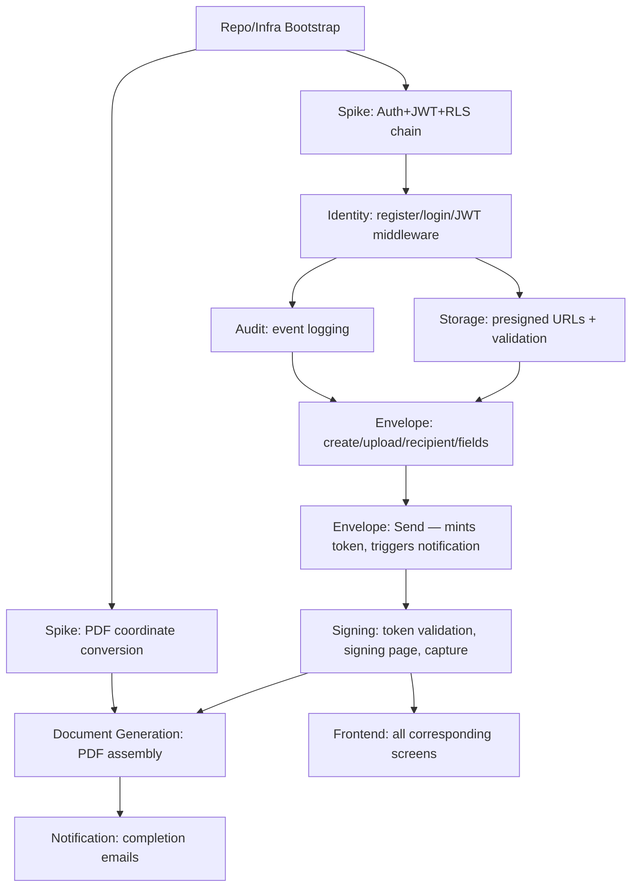

# InkFlow — Sprint 1 Planning

**Author:** Technical Architect (with Product Manager, Engineering Manager)
**Date:** 2026-07-01
**Status:** Draft — Awaiting Review (no cards move to To Do until approved)
**Builds on:** Product Vision v1.3, Deliverable 9 (board/template/sizing)

---

## Approach

Item 1 asked for features that form "a coherent, buildable Sprint 1 — a genuinely working, if narrow, end-to-end slice." I've scoped that at two levels, because being honest about sizing matters more than looking ambitious:

- **The Vertical Slice Epic** — the full minimal feature set needed for *any* single envelope to go from creation to a completed, signed PDF. This is the smallest set of features you genuinely can't cut further without breaking the loop.
- **Literal Sprint 1 (this week)** — a realistic subset of that epic. At Deliverable 9's sizing guide (S = hours, M = a day, L = multiple days) the full epic is roughly 3 weeks of work, not one. Rather than pretend otherwise, I'm recommending Sprint 1 cover the **foundation and highest-risk pieces**, with the rest sequenced and ready as Sprint 2/3 — not vague, just not committed yet.

---

## 1. Feature Scoping — What's In, What's Deferred, and Why

Every item in the Product Vision's feature list is tagged **Must Have** — there's no Should-Have tier to lean on for an easy cut. So deferral here is a **sequencing** decision (still ships in Phase 1, just not this week), not a scope cut — flagging clearly so PM can push back on any specific one.

### In the Vertical Slice Epic (build toward this over the next ~3 sprints)

F-01, F-02, F-03 (register/login/logout) · F-09, F-10, F-11 (create/upload/name envelope) · F-12 (single Signer recipient) · F-14, F-15 (signature + date fields) · F-15b (Draft editability) · F-16 (send) · F-19, F-20 (basic detail + dashboard) · F-21, F-22, F-24, F-25 (signing page, type-to-sign, date auto-populate, confirmation) · F-26 (signing request email) · F-28, F-29 (completion emails) · F-32 (completed PDF generation) · F-33 (download) · F-34, F-35 (audit trail)

### Explicitly deferred past this epic (flag if any of these blocks you)

| Deferred | Why it's safe to defer |
|---|---|
| F-04–F-08 (invite/deactivate/user list) | Multi-user company management is orthogonal to proving the core signing loop — one Admin is enough to test send→sign→complete |
| F-12a (internal recipient linking), F-19a (internal dashboard visibility) | Needs a second registered user to be meaningful at all |
| F-13 (real sequential/parallel logic), any multi-recipient orchestration | Single-signer envelopes make ordering moot — the atomic-consumption and next-signer logic (ADR-013) is real complexity worth its own dedicated sprint once the single-signer path is proven |
| F-15a, F-24a (text fields) | Signature + date fields alone prove the field-placement and PDF-overlay mechanics; a third field type is additive, not load-bearing |
| F-23 (draw-to-sign) | Type-to-sign alone proves the signature-capture path end to end; draw-to-sign is a canvas-capture feature, not a workflow feature |
| F-24b, F-30a (decline + its notification) | Decline's envelope-wide pause logic (ADR-016) is genuinely complex and deserves focused attention once the happy path works, not bolted on alongside it |
| F-17, F-18, F-30 (void, resend, void notification) | Failure/cancellation paths — the happy path should exist before its exception handling does |
| F-27, F-29a, F-29b (per-signature email, CC email, push status updates) | All meaningless with exactly one signer and no CC |
| F-33a (re-issue download link) | "Resend my copy" only matters once there's a copy to have lost |

**Net effect:** Sprint 1's epic target is exactly Product Vision §2's stated MVP workflow — *"send a document → sign a document → complete the envelope"* — at its narrowest legitimate form, with every deferred item still fully in scope for Phase 1, just sequenced after the loop itself is proven to work.

---

## 2. Technical Dependency Sequencing



**Why this order, in one line each:**
- **Bootstrap before anything** — no module can be built without a repo, a dev Supabase project, and a running local stack.
- **Both spikes run in parallel with each other, right after Bootstrap, before real feature work** — they de-risk the two architectural bets (the Auth→JWT→RLS chain from Deliverable 2 Batch 2, and the PDF coordinate math from Batch 4) before anything else depends on them being right.
- **Identity before literally everything session-authenticated** — every other module's routes sit behind the JWT middleware.
- **Audit early, not late** — nearly every other module's acceptance criteria includes "records an audit event," so the logging service needs to exist before those cards are workable, not bolted on after.
- **Storage before Envelope's upload flow** — Envelope's "upload a PDF" card literally calls Storage's presigned-URL function.
- **Envelope before Signing** — Signing needs a real envelope, recipient, and fields to validate a token against.
- **Signing before Document Generation** — can't assemble a completed PDF without a captured signature to overlay.
- **Frontend tracks its backend counterpart, not a separate phase** — each frontend card is paired with the API it calls, built once that API is stable, not stacked at the end.

---

## 3. Spike Cards

Two genuine spikes — unclear/risky enough to warrant a dedicated, timeboxed investigation before committing surrounding cards to a specific approach:

**Spike 1 — Auth + JWT + RLS integration chain.** This is the first real-world test of ADR-004/006/008 working together: Supabase Auth issues a JWT → FastAPI verifies it against JWKS → a DB lookup resolves company/role → RLS policies enforce isolation underneath. Each piece is individually well-understood, but they've never been proven working *together* in this actual codebase. Better to find a gap on day one than after three modules are built on top of an assumption.

**Spike 2 — PDF field-overlay coordinate conversion.** Flagged repeatedly since Deliverable 2 Batch 4 as the most likely source of subtle bugs (top-left UI origin → bottom-left PDF origin, normalized fractions → absolute points). Worth proving against a real sample PDF in isolation, with a dedicated test fixture, before it's wired into the full generation pipeline.

*(Worth a quick smoke test but not a full spike: Supabase Storage presigned upload/download from Next.js — a very standard pattern, lower risk than the two above. Folded into Storage's regular cards rather than spiked separately.)*

---

## 4. Full Backlog — Vertical Slice Epic (all cards, for visibility)

| # | Card | Type | Module | Size | Sprint |
|---|---|---|---|---|---|
| 1 | Repo scaffold & tooling | chore | infra | S | **1** |
| 2 | Supabase dev project + baseline migrations | chore | infra | S | **1** |
| 3 | Docker Compose local stack (API/Worker/Redis) | chore | infra | S | **1** |
| 4 | Minimal CI (lint/typecheck/test on PR) | chore | infra | M | **1** |
| 5 | Spike: Auth + JWT + RLS chain | spike | identity | S | **1** |
| 6 | Spike: PDF coordinate conversion | spike | docgen | S | **1** |
| 7 | Company + Admin registration | feature | identity | M | **1** |
| 8 | Login + JWT verification middleware | feature | identity | M | **1** |
| 9 | Audit event logging (write + read) | feature | audit | S | **1** |
| 10 | Presigned upload/download URLs | feature | storage | S | **1** |
| 11 | Server-side PDF validation on upload | feature | storage | S | **1** |
| 12 | Create envelope + upload PDF (Draft) | feature | envelope | M | **1** |
| 13 | Add recipient (single Signer) + field placement | feature | envelope | L | 2 |
| 14 | Send envelope (mint token, trigger notification) | feature | envelope | M | 2 |
| 15 | Signing token validation middleware | feature | signing | M | 2 |
| 16 | Signing page: review, sign (type-to-sign), submit | feature | signing | L | 2 |
| 17 | Mark envelope Completed | feature | signing | S | 2 |
| 18 | Envelope detail + minimal dashboard | feature | envelope | M | 2 |
| 19 | Completed PDF assembly (overlay + audit page) | feature | docgen | L | 2/3 |
| 20 | Wire PDF generation into RQ worker | feature | docgen | M | 2/3 |
| 21 | SendGrid wiring + signing-request email | feature | notification | S | 2 |
| 22 | Completion emails (sender + signer) | feature | notification | M | 2/3 |
| 23 | Frontend: registration + login | feature | frontend | M | 1/2 |
| 24 | Frontend: envelope creation + field placement | feature | frontend | L | 2 |
| 25 | Frontend: signing page UI | feature | frontend | L | 2/3 |
| 26 | Frontend: dashboard + detail view | feature | frontend | M | 2/3 |

**Sprint 1 = rows 1–12** (bolded), plus starting row 23 if there's room after 1–12. Rows 13–26 are Sprint 2/3 candidates, already sequenced and ready to pull once 1–12 land — nothing here is vague "later," it's ordered backlog.

---

## 5. Sprint 1 — Committed Cards (full template, per Deliverable 9 §6)

**Sprint Goal:** *A registered Company Admin can log in, create a Draft envelope, and upload a validated PDF — backed by a proven Auth+RLS chain, working audit logging, and a de-risked PDF-generation approach.*

---

### Card 1 — Repo scaffold & tooling setup
```
## Summary
Initialize the monorepo per Deliverable 4's structure — apps/api, apps/web, docs/, infra/, scripts/, base config files (pyproject.toml, package.json, .env.example, AGENTS.md placeholders).

## Type
chore

## Module
infra

## Acceptance Criteria
- [ ] Folder structure matches Deliverable 4 exactly
- [ ] `uv sync` and `npm install` both succeed from a clean clone
- [ ] Pre-commit hooks (ruff, mypy, prettier, eslint) installed and passing on an empty commit
- [ ] Root and per-app AGENTS.md/README.md placeholder files exist (content deferred to Deliverable 7)

## References
- Deliverable(s): 4, 5
- Related card(s): none (first card)

## Size
S

## Notes / Open Questions
None — fully specified by Deliverable 4.
```

---

### Card 2 — Supabase dev project + baseline migrations
```
## Summary
Provision the dedicated free-tier Supabase dev project and apply the baseline schema from Deliverable 2 Batch 3's ER diagram, with RLS enabled per Batch 3 §2.

## Type
chore

## Module
infra

## Acceptance Criteria
- [ ] Supabase dev project created, linked via Supabase CLI
- [ ] Migration creates: companies, profiles, envelopes, recipients, fields, audit_events, recipient_tokens
- [ ] RLS enabled on all tenant-scoped tables with the policies from Batch 3 §2
- [ ] `current_user_company_id()` helper function created

## References
- Deliverable(s): 2 (Batch 3), 10
- ADR: ADR-004, ADR-006, ADR-009
- Related card(s): #1

## Size
S

## Notes / Open Questions
None — schema and RLS policies are already fully specified.
```

---

### Card 3 — Docker Compose local stack
```
## Summary
Get API, Worker, and Redis running locally via Docker Compose, per Deliverable 10 §4.

## Type
chore

## Module
infra

## Acceptance Criteria
- [ ] `docker compose up` starts api, worker, redis successfully
- [ ] API container connects to the Supabase dev project (from Card 2) via env vars
- [ ] Worker container connects to Redis and can accept a trivial test job

## References
- Deliverable(s): 10
- Related card(s): #1, #2

## Size
S

## Notes / Open Questions
None.
```

---

### Card 4 — Minimal CI pipeline
```
## Summary
Stand up ci.yml (Deliverable 11 §2) — lint, type-check, and test on every PR. Deploy workflows are not needed yet (nothing to deploy to Staging until Sprint 2's cards land).

## Type
chore

## Module
infra

## Acceptance Criteria
- [ ] `ci.yml` runs ruff, mypy, eslint, tsc, pytest, vitest on every PR
- [ ] Branch protection on `develop`/`main` requires this workflow to pass before merge (Branching Strategy §3)

## References
- Deliverable(s): 6, 11
- Related card(s): #1

## Size
M

## Notes / Open Questions
Deploy-to-Staging/Production workflows deferred until there's something worth deploying — not built this card.
```

---

### Card 5 — Spike: Auth + JWT + RLS integration chain
```
## Summary
Prove the full chain works together: Supabase Auth signup → JWT issued → FastAPI middleware verifies via JWKS → DB lookup resolves company_id/role → RLS enforces isolation on a test query. Timeboxed investigation, not production code — findings feed directly into Cards 7/8.

## Type
spike

## Module
identity

## Acceptance Criteria
- [ ] A test script demonstrates: signup → JWT → verified request → RLS-scoped query returns only that company's data
- [ ] A second test company/user confirms cross-tenant queries are blocked
- [ ] Any gap or surprise in ADR-004/006/008's assumptions is documented before Cards 7/8 start

## References
- Deliverable(s): 2 (Batch 2), Handbook §13
- ADR: ADR-004, ADR-006, ADR-008
- Related card(s): #2, blocks #7, #8

## Size
S

## Notes / Open Questions
Timebox: half a day. If it reveals a real gap, that becomes its own follow-up card rather than silently absorbed into #7/#8's estimate.
```

---

### Card 6 — Spike: PDF field-overlay coordinate conversion
```
## Summary
Isolated proof, against a real sample PDF, that normalized (0.0-1.0, top-left origin) field coordinates convert correctly to absolute PDF points (bottom-left origin) using pypdf + reportlab. No integration with the rest of the pipeline yet.

## Type
spike

## Module
docgen

## Acceptance Criteria
- [ ] A standalone script overlays a known signature image at a known normalized coordinate onto a sample PDF
- [ ] Output visually verified (manually) to land in the correct position across at least 2 different page sizes
- [ ] Conversion logic extracted into a small, directly-testable function, with the isolated unit test already written (feeds Testing Strategy §4's non-negotiable list)

## References
- Deliverable(s): 2 (Batch 4 §4), 12 (§4)
- ADR: ADR-012, ADR-014
- Related card(s): blocks #19 (Sprint 2)

## Size
S

## Notes / Open Questions
Timebox: half a day. This is exactly the "looks obviously correct and isn't" risk flagged repeatedly — worth getting genuinely right here rather than assumed later.
```

---

### Card 7 — Company + Admin registration
```
## Summary
A new user can register, creating both a Supabase Auth identity and the corresponding Company + Profile (Admin role) records — the split-responsibility flow from Deliverable 2 Batch 2 §1.

## Type
feature

## Module
identity

## Acceptance Criteria
- [ ] POST to Supabase Auth signUp succeeds
- [ ] API creates Company + Profile(role=admin) immediately after, linked to the new user_id
- [ ] Duplicate company registration attempt (same admin trying twice) handled gracefully
- [ ] Audit event NOT required here (no envelope yet — nothing to log against)

## References
- Feature: F-01
- Deliverable(s): 2 (Batch 2 §1)
- Related card(s): #5 (spike must complete first)

## Size
M

## Notes / Open Questions
None — flow fully specified by Batch 2.
```

---

### Card 8 — Login + JWT verification middleware
```
## Summary
Existing users can log in via Supabase Auth; the API's middleware verifies the resulting JWT on every subsequent request per the request lifecycle in Deliverable 2 Batch 2 §3, resolving company_id/role via DB lookup (ADR-008).

## Type
feature

## Module
identity

## Acceptance Criteria
- [ ] Login returns a valid JWT
- [ ] Middleware rejects missing/expired/invalid JWTs with 401
- [ ] Middleware resolves and attaches company_id/role/active to request context via DB lookup, per ADR-008
- [ ] Inactive profile is rejected with 401 even with a structurally valid JWT
- [ ] JWKS keys cached per Batch 2's caching guidance, not fetched per-request

## References
- Feature: F-02
- Deliverable(s): 2 (Batch 2 §3)
- ADR: ADR-008
- Related card(s): #5, #7

## Size
M

## Notes / Open Questions
None.
```

---

### Card 9 — Audit event logging (write + read)
```
## Summary
The append-only Audit module: a write function any other module can call to record an event, and a read endpoint for the (future) audit trail view.

## Type
feature

## Module
audit

## Acceptance Criteria
- [ ] `record_event(envelope_id, event_type, actor, ip_address, metadata)` inserts an audit_events row
- [ ] Events are genuinely append-only — no update/delete path exists in the service layer
- [ ] GET endpoint returns an envelope's full event log, ordered chronologically
- [ ] Actor identity is captured as a snapshot at write time, not a live join to profiles/recipients (BR-25a)

## References
- Feature: F-34, F-35
- Business Rule: BR-25a
- Deliverable(s): 2 (Batch 3)
- Related card(s): #8

## Size
S

## Notes / Open Questions
None — this exists specifically to unblock Cards 12+ which all call into it.
```

---

### Card 10 — Presigned upload/download URLs
```
## Summary
Storage module wrapper around Supabase Storage: generate short-lived presigned PUT/GET URLs, per Deliverable 2 Batch 3 §4/§6.

## Type
feature

## Module
storage

## Acceptance Criteria
- [ ] Function generates a presigned upload URL scoped to `{company_id}/{envelope_id}/original.pdf`
- [ ] Function generates a presigned download URL for a given storage key
- [ ] Both URLs have short TTL (~5 min) per Batch 3

## References
- Deliverable(s): 2 (Batch 3 §4, §6)
- Related card(s): #8

## Size
S

## Notes / Open Questions
None.
```

---

### Card 11 — Server-side PDF validation on upload
```
## Summary
After a browser uploads directly to Storage, the API validates the actual uploaded file server-side before the envelope proceeds — magic bytes, real size, page count — never trusting client-declared metadata (BR-12c).

## Type
feature

## Module
storage

## Acceptance Criteria
- [ ] Confirm-upload endpoint checks the file's actual bytes for a valid `%PDF` header
- [ ] Rejects files over 25MB (actual size, not client-declared) with a clear error
- [ ] Extracts and stores real page count
- [ ] Non-PDF or oversized files result in a 400, envelope stays unconfirmed

## References
- Business Rule: BR-12c
- Deliverable(s): 2 (Batch 3 §4)
- Related card(s): #10

## Size
S

## Notes / Open Questions
None.
```

---

### Card 12 — Create envelope + upload PDF (Draft)
```
## Summary
A logged-in Sender can create a new Draft envelope, name it, and upload a PDF via the presigned-URL flow — the first real cross-module integration (Identity + Storage + Audit + Envelope).

## Type
feature

## Module
envelope

## Acceptance Criteria
- [ ] POST /api/v1/envelopes creates a Draft envelope owned by the caller
- [ ] Upload flow follows Card 10/11's presigned URL + validation sequence
- [ ] `envelope.created` audit event recorded (Card 9)
- [ ] Envelope correctly scoped to the caller's company_id (RLS + app-layer check)
- [ ] GET the created envelope returns it, and a second test company cannot see it

## References
- Feature: F-09, F-10, F-11
- Deliverable(s): 2 (Batch 3 §4)
- Related card(s): #7, #8, #9, #10, #11

## Size
M

## Notes / Open Questions
None — this is the card that proves Sprint 1's foundation actually holds together end to end.
```

---

## Summary

- **12 cards committed for Sprint 1**, all fully specified (Deliverable 9's DoR is met for each — no open product/architecture questions blocking any of them).
- **Sprint Goal** stated above, checkable against Card 12's acceptance criteria specifically.
- **Rows 13–26** are the sequenced Sprint 2/3 backlog — not vague future work, ready to pull once Sprint 1 lands.
- **Two spikes** (Cards 5, 6) run first, de-risking the two architectural assumptions everything else depends on.

Nothing here moves to To Do until you and the PM/EM sign off — flagging as instructed.
